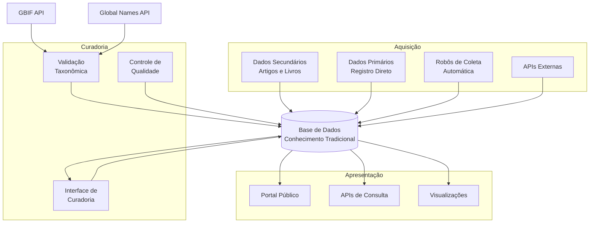
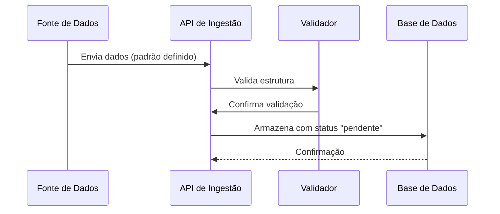
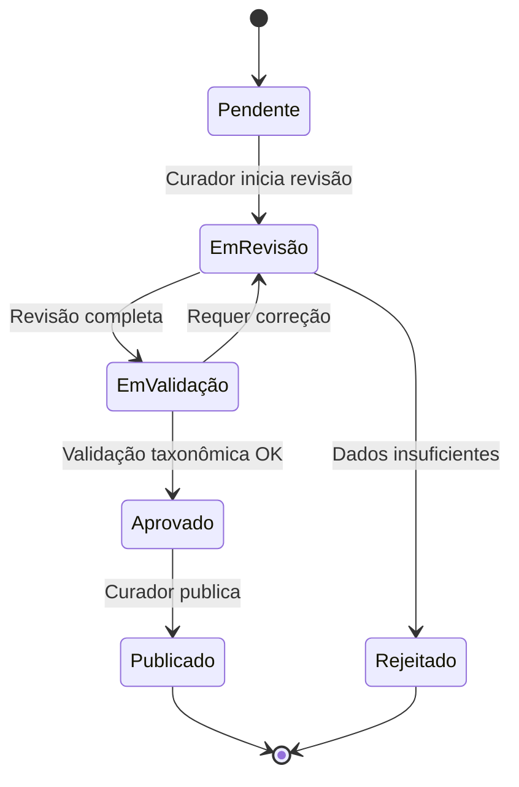

# Sistema de Informações sobre Conhecimento Tradicional Associado à Biodiversidade

## Visão Geral

Este repositório contém a proposta de arquitetura para um sistema de informações dedicado à preservação, curadoria e compartilhamento de conhecimento tradicional associado à biodiversidade. O sistema foi projetado com respeito aos princípios **C.A.R.E.** (Collective Benefit, Authority to Control, Responsibility, Ethics) e em conformidade com a legislação pertinente.

---

## Motivação e Justificativa

### O Cenário Atual: Fragmentação de Iniciativas

O Brasil possui múltiplas iniciativas de qualidade mundial para sistematizar conhecimento tradicional associado à biodiversidade, porém operam de forma isolada sem arquitetura comum que permita integração e sinergia:

#### 1. Projeto GEF "Entre-Ciências" (2025-2029)
Projeto de grande porte (US$ 80 milhões) coordenado pelo MCTI para fortalecer capacidade de Povos Indígenas e Comunidades Locais (PIPCTAFs) gerenciarem dados sobre sociobiodiversidade em Amazônia e Cerrado, usando padrões DarwinCore/PlinianCore via SiBBr.

#### 2. Rede de Conhecimentos sobre Sociobiodiversidade (RCS)
Iniciativa do ICMBio (CNPT) em parceria com UFSC que busca integrar bases de dados dispersas em plataforma única, com ênfase em protocolos comunitários e Consentimento Livre, Prévio e Informado (CLPI).

#### 3. Modernização do SISGEN (RNP-MMA-BID)
Projeto de 13 meses para modernizar o Sistema Nacional de Gestão do Patrimônio Genético e CTA, implementando interoperabilidade via IPT (Integrated Publishing Toolkit) com padrões FAIR e CARE.

#### 4. Useflor@: Banco de Dados Etnobotânicos (UFSC)
Sistema prático com 3.359 registros etnobotânicos validados, implementando inovador "Registro Comunitário" onde comunidades definem níveis de acesso a seus conhecimentos.

### O Problema da Fragmentação

Apesar de perseguirem objetivos convergentes, essas iniciativas geram:

- **Dispersão de dados**: mesmo conhecimento armazenado em múltiplos sistemas sem sincronização
- **Padrões inconsistentes**: Useflor@ (41 campos relacional), GEF (DarwinCore), SISGEN (patrimônio genético), RCS (agregador flexível)
- **Replicação de esforços**: múltiplos "registros comunitários" em desenvolvimento paralelo
- **Soberania fragmentada**: comunidades interagem com sistemas desconectados
- **Pesquisa limitada**: impossível fazer queries que atravessem iniciativas
- **Sustentabilidade em risco**: cada um com seu ciclo de financiamento e dependências

### Oportunidade de Integração

Uma arquitetura integrada possibilitaria:

✅ **Interoperabilidade sem perda de autonomia**: camada comum permite compartilhamento mantendo independência
✅ **Registro comunitário unificado**: comunidade faz login uma única vez, direitos propagam para todas plataformas
✅ **Governança consistente**: FAIR + CARE implementados uniformemente
✅ **Busca e análise integrada**: pesquisadores com visão completa da biodiversidade
✅ **Repartição de benefícios rastreável**: Lei 13.123/2015 cumprida efetivamente

### Imperativo Legal e Institucional

A fragmentação coloca em risco o cumprimento de:
- **Lei 13.123/2015**: comunidades precisam ser informadas sobre usos de conhecimento (impossível se disperso)
- **Protocolo de Nagoya**: exige rastreabilidade internacional (integração técnica essencial)
- **CDB Art. 8j**: participação ativa de detentores (integração facilitaria essa participação)

### Convergência das Iniciativas

Todas compartilham:
- Objetivo de sistematizar CTA
- Desafio de proteção do conhecimento tradicional
- Mesma base legal (Lei 13.123/2015)
- Compatibilidade técnica (SiBBr, infraestrutura de dados aberta, padrões interoperáveis)
- Cobertura geográfica complementar (juntas cobrem praticamente toda biodiversidade brasileira)

**Esta proposta de arquitetura não busca substituir as iniciativas existentes, mas criar camada de integração que possibilite interoperabilidade, estabeleça padrões mínimos sem sacrificar autonomia, e implemente governança compartilhada com protagonismo comunitário.**

---

## Objetivos

- **Preservar** o conhecimento tradicional de comunidades sobre o uso de plantas e biodiversidade
- **Validar** e qualificar dados através de processos curatoriais rigorosos
- **Compartilhar** informações de forma ética e responsável com pesquisadores e público geral
- **Integrar** múltiplas fontes de dados, desde artigos científicos até registros primários
- **Automatizar** a captura de informações relevantes de fontes confiáveis

## Arquitetura do Sistema

O sistema é organizado em **três contextos principais** que trabalham de forma integrada:



### 1. Contexto de Aquisição

Responsável pela **entrada de dados** no sistema de múltiplas fontes:

- **Dados Secundários**: Extração de informações de artigos científicos, livros e publicações
- **Dados Primários**: Registro direto com todos os cuidados éticos e legais necessários
- **Coleta Automatizada**: Robôs que monitoram periódicos científicos (ex: etnobotânica)
- **Integrações**: APIs para consumo de dados de sistemas externos



**Características principais:**
- Padrão de dados unificado para todas as fontes
- APIs RESTful para ingestão
- Sistema de fila para processamento assíncrono
- Validação automática de dados taxonômicos via GBIF e Global Names

### 2. Contexto de Curadoria

Interface dedicada para **qualificação e validação** dos dados:

- Acesso restrito a pesquisadores e representantes de comunidades
- Workflow de aprovação e enriquecimento de dados
- Integração com APIs de validação taxonômica
- Controle de versões e auditoria de alterações



### 3. Contexto de Apresentação

Portal público para **acesso e consulta** das informações validadas:

- Interface web responsiva
- APIs públicas de consulta
- Visualizações interativas
- Sistema de busca avançada
- Exportação de dados em formatos abertos

## Tecnologias Consideradas

### Banco de Dados

Devido à **complexidade e flexibilidade** necessárias para armazenar conhecimento tradicional, três abordagens são consideradas:

1. **Bancos de Dados SQL** - Modelo relacional
   - Estrutura rigorosa com esquema bem definido
   - Integridade referencial garantida
   - Consultas poderosas em dados estruturados
   - Ideal para relacionamentos complexos

2. **Bancos Orientados a Documentos (JSON)**
   - Flexibilidade no esquema
   - Escalabilidade horizontal
   - Consultas ricas em documentos estruturados como JSON
   - Armazenamento natural de dados semi-estruturados

3. **Bancos Multi-Modais**
   - Suportam múltiplos modelos de dados (documentos, grafos, relações)
   - Permitem modelar relações complexas entre entidades
   - Query language moderna e versátil
   - Flexibilidade arquitetural para evolução futura

### Integrações Externas

- **GBIF API** (https://www.gbif.org/) - Validação de dados taxonômicos
- **Global Names Verifier** (https://verifier.globalnames.org/api) - Verificação de nomenclatura científica
- Periódicos científicos via APIs ou scraping ético

## Princípios Orientadores

### C.A.R.E. Principles

- **Collective Benefit**: Os dados devem beneficiar as comunidades que os originaram
- **Authority to Control**: Comunidades mantêm autoridade sobre seus conhecimentos
- **Responsibility**: Responsabilidade ética no manejo dos dados
- **Ethics**: Respeito às práticas éticas e culturais

### Legislação

O sistema respeita:
- Lei da Biodiversidade (Lei 13.123/2015)
- Protocolo de Nagoya
- Legislações locais sobre conhecimento tradicional

## Estrutura da Documentação

Este repositório está organizado da seguinte forma:

```
etnoArquitetura/
├── README.md (este arquivo)
├── docs/
│   ├── c4-model/
│   │   ├── 01-context-diagram.md
│   │   ├── 02-container-diagram.md
│   │   └── 03-component-diagram.md
│   ├── architecture-decisions/
│   │   ├── ADR-001-database-selection.md
│   │   ├── ADR-002-api-standards.md
│   │   └── ADR-003-data-model.md
│   └── diagrams/
│       ├── data-flow.md
│       └── integration-patterns.md
```

### Navegação da Documentação

1. **[Diagrama de Contexto](docs/c4-model/01-context-diagram.md)** - Visão de alto nível do sistema e seus usuários
2. **[Diagrama de Containers](docs/c4-model/02-container-diagram.md)** - Componentes principais e suas tecnologias
3. **[Diagrama de Componentes](docs/c4-model/03-component-diagram.md)** - Detalhamento interno de cada contexto
4. **[Decisões Arquiteturais](docs/architecture-decisions/)** - ADRs documentando escolhas técnicas

## Próximos Passos

1. Definição detalhada do modelo de dados
2. Prototipação das APIs de ingestão
3. Desenvolvimento do sistema de autenticação e autorização
4. Implementação do workflow de curadoria
5. Desenvolvimento da interface pública

---

## Integração com Referências e Iniciativas

### Arquitetura Inspirada em NIKMAS

A proposta de arquitetura incorpora lições aprendidas do projeto **NIKMAS (National Indigenous Knowledge Management System)** da África do Sul, especialmente:

- **Modelo de Dados Dual**: Preservação simultânea de artefatos originais (gravações audiovisuais, fotos) e estruturas de metadados formais para proteção legal
- **Arquitetura Distribuída**: Nó central com Pontos de Presença (PoPs) regionais para captura descentralizada e sincronização seletiva respeitando confidencialidade
- **Segurança Multi-Camadas**: Controle de acesso baseado em políticas (XACML) para proteção de conhecimento sensível
- **Catálogo de Detentores**: Base de dados de indivíduos e comunidades detentores de conhecimento com rastreamento de proveniência
- **Curadoria Estruturada**: Interface dedicada para especialistas validarem e anotarem dados

### Acesso via Comunicações Móveis

Reconhecendo que muitas comunidades tradicionais em áreas remotas têm acesso móvel limitado mas penetrante, a arquitetura prevê:

- **Aplicações Mobile Offline-First**: Captura de dados sem necessidade de conexão permanente
- **Integração SMS/USSD**: Acesso a informações via mensagens de texto para regiões com infraestrutura móvel limitada
- **WhatsApp Integration**: Suporte a plataforma popular para comunicação e consultas
- **Apps Comunitárias**: Desenvolvimento de aplicativos customizados para diferentes contextos culturais

Esta abordagem segue exemplos bem-sucedidos como **CyberTracker** e **MAPEO**, que demonstram o potencial de tecnologias móveis para empoderamento comunitário em monitoramento participativo.

### Validação e Certificação de Dados

O sistema implementa um **workflow robusto de validação** em múltiplas etapas:

1. **Validação Estrutural**: Verificação automática de conformidade com padrões de dados (Darwin Core, Plinian Core)
2. **Validação Taxonômica**: Integração com GBIF API e Global Names para verificação de nomenclatura científica
3. **Curadoria Especializada**: Revisão por especialistas de domínio (botânicos, etnobólogos, farmacêuticos tradicionais)
4. **Validação Comunitária**: Participação de detentores de conhecimento na certificação de dados antes de publicação
5. **Rastreabilidade Completa**: Logs de auditoria de todas as mudanças e validações

### Aquisição de Dados Primários

Para coleta ética e consentida de dados diretamente das comunidades:

- **Processo CLPI (Consentimento Livre, Prévio e Informado)**: Implementação de protocolo completo baseado em Lei 13.123/2015
- **Registro Comunitário**: Interface para comunidades registrarem autonomamente seu próprio conhecimento
- **Acordos Eletrônicos**: Armazenamento e rastreamento de acordos de compartilhamento de benefícios
- **Infopreneurs Locais**: Capacitação de membros da comunidade como coletores de dados com oportunidades de geração de renda
- **Documentação Audiovisual**: Suporte a preservação de conhecimento em múltiplas formas (áudio, vídeo, foto, texto)

### Integração com Plataforma de Territórios Tradicionais do MPF

A arquitetura está projetada para **integração bidirecional** com a [Plataforma de Territórios Tradicionais](https://territoriostradicionais.mpf.mp.br/) do Ministério Público Federal:

- **Sincronização de Polígonos Territoriais**: Importação automática de limites geográficos de territórios indígenas e tradicionais
- **Cruzamento Espacial**: Associação de registros de conhecimento com territórios de origem
- **Rastreabilidade Geográfica**: Visualização interativa de onde conhecimentos são praticados
- **Dados Públicos do MPF**: Acesso a informações sobre status de demarcação, conflitos e historicamente de ocupação
- **API de Integração**: Endpoints REST para consulta e sincronização de dados territoriais

Esta integração fortalece:
- Rastreabilidade de conhecimento até sua origem territorial
- Suporte a processos de demarcação e regularização
- Monitoramento de ameaças a territórios que guardam conhecimento tradicional
- Conformidade com Lei 13.123/2015 sobre proveniência geográfica

### Padrões de Dados Abertos

A arquitetura adota e contribui para padrões de dados abertos reconhecidos:

- **Darwin Core**: Para ocorrências de espécies e dados de biodiversidade
- **Plinian Core**: Para descrições de espécies e informações sobre usos
- **Dublin Core Estendido**: Para metadados ricos e flexíveis
- **SocioBio Standard**: Padrão específico para dados de sociobiodiversidade brasileira (ver [projeto SocioBio no GitHub](https://github.com/sibbr/sociobio))

### Interoperabilidade com Sistemas Nacionais

Integração planejada com principais sistemas brasileiros:

- **SiBBr** (Sistema de Informação sobre Biodiversidade Brasileira): Nó brasileiro do GBIF
- **SisGen** (Sistema Nacional de Gestão do Patrimônio Genético): Rastreamento de acesso e repartição de benefícios
- **CNPq**: Integração com dados de pesquisadores e grupos de pesquisa
- **GBIF Global**: Contribuição de dados brasileiros para rede global de biodiversidade

---

## Referências

### Legislação Brasileira Relevante

1. **Lei nº 13.123, de 20 de maio de 2015**
   - Regulamenta o acesso ao patrimônio genético, proteção e acesso ao conhecimento tradicional associado
   - [Lei 13.123/2015 - Portal Planalto](https://www.planalto.gov.br/ccivil_03/_ato2015-2018/2015/lei/l13123.htm)
   - [Manual da Lei da Biodiversidade - UFRRJ](https://institucional.ufrrj.br/sisgen/files/2021/04/Manual-LeiDaBiodiversidade.pdf)

2. **Decreto nº 8.772, de 11 de maio de 2016**
   - Regulamenta a Lei 13.123/2015

3. **Decreto nº 6.040, de 7 de fevereiro de 2007**
   - Instituiu Política Nacional de Desenvolvimento Sustentável dos Povos e Comunidades Tradicionais

4. **Decreto nº 8.726, de 27 de abril de 2016**
   - Regulamenta Lei 13.019/2014 sobre parcerias com organizações da sociedade civil

### Legislação Internacional e Convenções

5. **Convenção sobre Diversidade Biológica (CDB - 1992)**
   - Artigo 8(j): Proteção e valorização de conhecimentos tradicionais
   - Texto completo e informações em [português](https://www.mma.gov.br/estruturas/sbf/_arquivos/cdb.pdf)

6. **Protocolo de Nagoia sobre Acesso a Recursos Genéticos e Repartição Justa e Equitativa de Benefícios**
   - Ratificado pelo Brasil em 2021
   - [Decreto 11.865/2023 - Promulgação do Protocolo](https://www.planalto.gov.br/ccivil_03/_ato2023-2026/2023/decreto/d11865.htm)
   - [Protocolo de Nagoia - Portal Fiocruz](https://fiocruz.br/protocolo-de-nagoia)

7. **Convenção 169 da OIT sobre Povos Indígenas e Tribais**
   - Artigos sobre consulta prévia, livre e informada
   - [Portal OIT](https://www.ilo.org/brasilia/convencoes)

### Padrões de Dados e Metadados

8. **Darwin Core: An Evolving Community-Developed Biodiversity Data Standard**
   - Wieczorek, J., Bloom, D., Guralnick, R., et al. (2012)
   - PLoS ONE 7(1): e29715
   - [Artigo completo - PMC](https://www.ncbi.nlm.nih.gov/pmc/articles/PMC3253084/)
   - [Darwin Core Official - TDWG](https://dwc.tdwg.org/)
   - [O que é Darwin Core - GBIF](https://www.gbif.org/darwin-core)

9. **Plinian Core: A New Standard for Species Data**
   - Padrão específico para informações sobre espécies e seus usos
   - [Documentação oficial](https://terms.tdwg.org/wiki/Plinian_Core)

10. **METS (Metadata Encoding and Transmission Standard)**
    - Cantara, L. (2005). "METS: The Metadata Encoding and Transmission Standard"
    - Cataloging & Classification Quarterly, 40(3):237–253

11. **Dublin Core Metadata Element Set**
    - Padrão para descrição de recursos digitais
    - [Documentação oficial](https://www.dublincore.org/)

12. **SocioBio: Padrão de Dados para Sociobiodiversidade**
    - Projeto colaborativo do SiBBr para dados de conhecimento tradicional
    - [Projeto no GitHub](https://github.com/sibbr/sociobio)

### Sistemas de Informação sobre Biodiversidade

13. **SiBBr - Sistema de Informação sobre a Biodiversidade Brasileira**
    - Coordenado pelo MCTI, operacionalizado pela RNP
    - [SiBBr oficial](https://www.sibbr.gov.br/)
    - [Informações sobre SiBBr - GBIF](https://www.gbif.org/publisher/f5fd374b-89cb-4ab6-b3eb-794c65f232c3)

14. **GBIF - Global Biodiversity Information Facility**
    - Maior rede de compartilhamento de dados de biodiversidade
    - [GBIF.org](https://www.gbif.org/)
    - [Darwin Core em GBIF](https://www.gbif.org/standards)

15. **IPT: Integrated Publishing Toolkit**
    - Ferramenta GBIF para publicação de dados de biodiversidade
    - Kohlmann, B., Vargas-Z., J.M., Delgado, B., et al. (2012)
    - PLOS One 7(11): e50623
    - [IPT - GBIF](https://www.gbif.org/ipt)
    - [IPT Manual](https://ipt.gbif.org/manual/)
    - [IPT no GitHub](https://github.com/gbif/ipt)

16. **OBIS - Ocean Biodiversity Information System**
    - Sistema especializado em dados de biodiversidade marinha
    - [OBIS.org](https://www.obis.org/)

### Governança de Dados e Princípios

17. **FAIR Principles for Data Management**
    - Wilkinson, M.D., Dumontier, M., Aalbersberg, I.J., et al. (2016)
    - Scientific Data 3:160018
    - [Artigo completo - Nature](https://www.nature.com/articles/sdata201618)
    - [Tradução para português](https://www.lume.ufrgs.br/handle/10183/229806)

18. **CARE Principles for Indigenous Data Governance**
    - Carroll, S.R., Herczog, I., Hudson, M., et al. (2020)
    - Data Science Journal 19(1):43
    - [Artigo - Data Science Journal](https://datascience.codata.org/articles/10.5334/dsj-2020-043)
    - [CARE Principles oficial - GIDA](https://www.gida-global.org/care)
    - [Operacionalizando CARE e FAIR - Nature](https://www.nature.com/articles/s41597-021-00892-0)

19. **Consentimento Livre, Prévio e Informado (CLPI)**
    - Direito humano para povos indígenas e tradicionais
    - [CLPI e Convenção 169 OIT](https://especiais.socioambiental.org/inst/esp/consulta_previa/index7397.html)
    - [CLPI no Ministério Público](https://escola.mpu.mp.br/publicacoesepesquisas/periodicos/boletim-cientifico/edicoes-do-boletim/boletim-cientifico-n-45-julho-dezembro-2015/o-direito-humano-ao-consentimento-livre-previo-e-informado-como-baluarte-do-sistema-juridico-de-protecao-dos-conhecimentos-tradicionais)
    - [Observatório de Protocolos Comunitários](https://observatorio.direitosocioambiental.org/)

### Arquitetura de Sistemas para Conhecimento Indígena

20. **Software Architecture for an Indigenous Knowledge Management System**
    - Britz, J., Lor, P., Coates, D., & Cummings, R. (2006)
    - Descreve o sistema NIKMAS (National Indigenous Knowledge Management System) da África do Sul
    - Demonstra abordagem de biblioteca digital semântica para CTA

21. **Fedora Digital Repository Architecture**
    - Lagoze, C., Payette, S., Shin, E., & Wilper, C. (2006)
    - International Journal on Digital Libraries 6(2):124–138
    - [Fedora oficial](https://duraspace.org/fedora/)

22. **Data Sovereignty in Community-Based Environmental Monitoring**
    - Todd, D., Hawley-Kipp, T., & Oliver, V. (2023)
    - BioScience 72(8):714–729
    - [Artigo - Oxford Academic](https://academic.oup.com/bioscience/article/72/8/714/6610022)

### Tecnologias Móveis para Coleta de Dados

23. **CyberTracker: Conservation Software for Mobile Data Collection**
    - Ferramenta desenvolvida para rastreadores africanos e comunidades indígenas
    - [CyberTracker.org](https://www.zanza-africa.com/conservation-software/cybertracker)

24. **MAPEO: Offline-First Mapping and Evidence Platform**
    - Desenvolvido por Digital Democracy para mapeamento comunitário
    - Implementa data sovereignty com arquitetura peer-to-peer
    - [MAPEO oficial](https://www.digital-democracy.org/mapeo/)

25. **Participatory Mapping in the Mobile Age**
    - Artigo sobre tecnologias móveis para mapeamento participativo
    - [Mongabay Wild Tech](https://news.mongabay.com/wildtech/2016/04/participatory-mapping-in-the-mobile-age/)

### Etnobiologia e Conhecimento Tradicional

26. **Ethnobotany and Traditional Ecological Knowledge**
    - Albuquerque, U.P., Lucena, R.F.P., & Alencar, N.L. (2010)
    - Ethnobotany Research and Applications 8:193–203

27. **Descriptive Ethnobotanical Studies for Rescue of Traditional Knowledge**
    - Journal of Ethnobiology and Ethnomedicine (2023)
    - [Artigo - BioMed Central](https://ethnobiomed.biomedcentral.com/articles/10.1186/s13002-023-00604-5)

28. **Banco de Dados Etnobotânicos: Useflor@**
    - Ferrari, P.A. (2020)
    - Trabalho de Conclusão de Curso
    - Universidade Federal de Santa Catarina
    - Implementação prática de validação de conhecimento tradicional

### Projetos e Iniciativas Brasileiras

29. **Projeto GEF "Entre-Ciências"**
    - Fortalecimento de Povos Indígenas para Gerenciar Dados sobre Sociobiodiversidade
    - MCTI/PNUMA/IEB (2025-2029)
    - [Informações do Projeto](https://www.thegef.org/projects-operations/projects/11269)

30. **Rede de Conhecimentos sobre Sociobiodiversidade (RCS)**
    - ICMBio/CNPT em parceria com UFSC
    - Integração de bases de dados dispersas
    - [Página da RCS](https://www.icmbio.gov.br/cnpt/projetos/rede-conhecimentos-sociobiodiversidade)

31. **SisGen - Sistema Nacional de Gestão do Patrimônio Genético e CTA**
    - Gerenciamento de acesso e repartição de benefícios
    - [SisGen.gov.br](https://sisgen.gov.br/)
    - Projeto de modernização com RNP-MMA-BID

32. **Plataforma de Territórios Tradicionais do MPF**
    - Mapa interativo de territórios indígenas e tradicionais
    - [Plataforma oficial](https://territoriostradicionais.mpf.mp.br/)
    - Fornecedor de informações geoespaciais para integração

### Preservação Digital e Archivos

33. **The Reference Model for an Open Archival Information System (OAIS)**
    - ISO 14721:2012
    - Framework para preservação de longo prazo de informação digital

34. **Memory Practices in the Sciences**
    - Bowker, G. (2005)
    - MIT Press Cambridge, MA
    - Teoria sobre preservação de conhecimento

### Redes de Pesquisa e Colaboração

35. **CNPq - Conselho Nacional de Desenvolvimento Científico e Tecnológico**
    - Plataforma Lattes
    - Grupo de Pesquisa em Conhecimento Tradicional
    - [CNPq.br](https://www.cnpq.br/)

36. **Pesquisa e Desenvolvimento Participativo**
    - Berkes, F., Folke, C., & Gadgil, M. (1995)
    - "Traditional ecological knowledge, biodiversity, resilience and sustainability"
    - Beijer International Institute of Ecological Economics

### Documentos Técnicos e Manuais

37. **Manual de Implementação da Lei da Biodiversidade**
    - Ministério do Meio Ambiente
    - Guia prático para gestão de conhecimento tradicional

38. **XACML: eXtensible Access Control Markup Language**
    - Moses, T., et al. (2005)
    - OASIS Standard para controle de acesso
    - [Documentação oficial](https://www.oasis-open.org/standards#xacml)

### Artigos de Referência Adicional

39. **Indigenous Knowledge Digital Libraries**
    - Gupta, V. (2005)
    - Estudo de casos internacionais em gestão de CTA

40. **Traditional Knowledge Digital Library (TKDL) - Índia**
    - Sistema de proteção contra biopirataria
    - Modelo internacional de referência
    - [TKDL.org.in](https://tkdl.org.in/)

41. **People's Biodiversity Register (PBR) - Índia**
    - Gadgil, M., et al. (1996)
    - Registro comunitário de conhecimento sobre biodiversidade
    - Modelo participativo de 25+ anos

42. **Desa Informasi Initiative**
    - Tjiek, T., et al. (2006)
    - "The role of digital libraries in the preservation and dissemination of indigenous knowledge"
    - The International Information & Library Review, 38(3):123–131

### Citações Complementares sobre Arquitetura

43. **Architectural Blueprints - The 4+1 View Model**
    - Kruchten, P. (1995)
    - IEEE Software 12(6):42–50
    - Framework utilizado para documentação da arquitetura

---

## Sugestões para Complementar as Referências

As referências acima cobrem:
- ✅ Legislação brasileira e internacional relevante
- ✅ Padrões de dados abertos (Darwin Core, Plinian Core, Dublin Core)
- ✅ Arquitetura de sistemas (NIKMAS, Fedora, OAI)
- ✅ Governança de dados (FAIR, CARE)
- ✅ Tecnologias móveis (CyberTracker, MAPEO)
- ✅ Etnobiologia e conhecimento tradicional
- ✅ Iniciativas brasileiras práticas
- ✅ Data sovereignty e consentimento livre prévio informado

Sugestões adicionais de leitura pode ser consultadas nos documentos de decisão arquitetural (ADRs) e nos diagramas C4 do projeto.

---

## Contribuindo

Este é um projeto em fase de proposta. Contribuições e sugestões são bem-vindas através de issues e pull requests.

## Licença

A definir - considerando licenças que respeitem os princípios C.A.R.E. e protejam adequadamente o conhecimento tradicional.

## Contato

Para mais informações sobre este projeto, entre em contato através das issues deste repositório.
