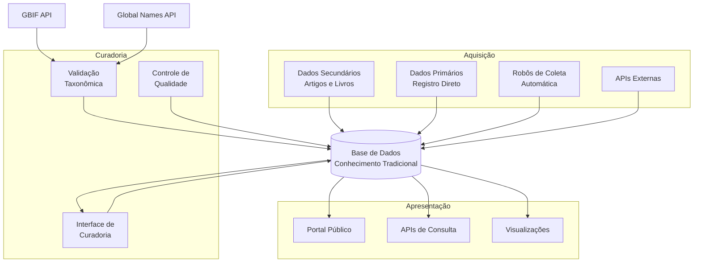
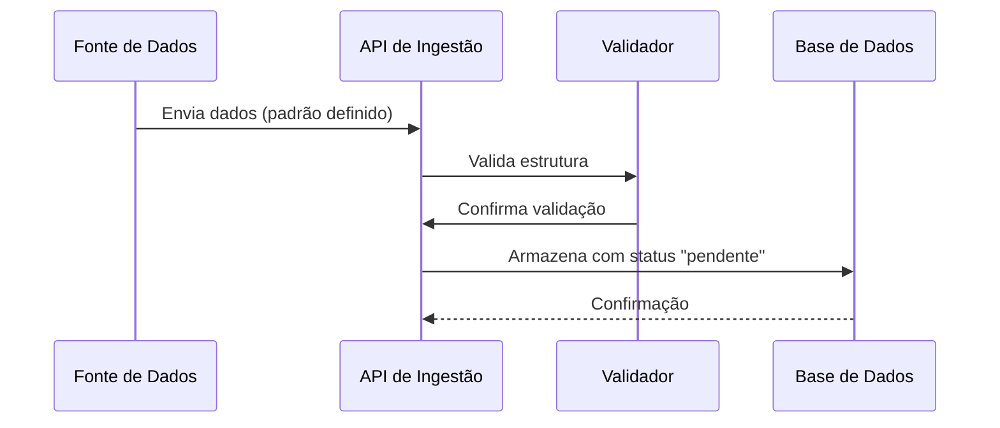
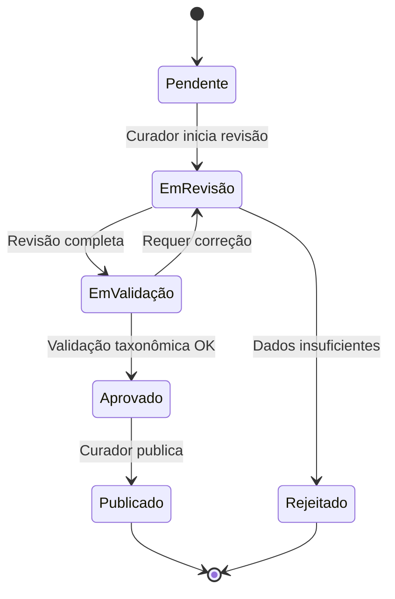

# Sistema de Informações sobre Conhecimento Tradicional Associado à Biodiversidade

## Visão Geral

Este repositório contém a proposta de arquitetura para um sistema de informações dedicado à preservação, curadoria e compartilhamento de conhecimento tradicional associado à biodiversidade. O sistema foi projetado com respeito aos princípios **C.A.R.E.** (Collective Benefit, Authority to Control, Responsibility, Ethics) e em conformidade com a legislação pertinente.

## Objetivos

- **Preservar** o conhecimento tradicional de comunidades sobre o uso de plantas e biodiversidade
- **Validar** e qualificar dados através de processos curatoriais rigorosos
- **Compartilhar** informações de forma ética e responsável com pesquisadores e público geral
- **Integrar** múltiplas fontes de dados, desde artigos científicos até registros primários
- **Automatizar** a captura de informações relevantes de fontes confiáveis

## Arquitetura do Sistema

O sistema é organizado em **três contextos principais** que trabalham de forma integrada:



### 1. Contexto de Aquisição

Responsável pela **entrada de dados** no sistema de múltiplas fontes:

- **Dados Secundários**: Extração de informações de artigos científicos, livros e publicações
- **Dados Primários**: Registro direto com todos os cuidados éticos e legais necessários
- **Coleta Automatizada**: Robôs que monitoram periódicos científicos (ex: etnobotânica)
- **Integrações**: APIs para consumo de dados de sistemas externos



**Características principais:**
- Padrão de dados unificado para todas as fontes
- APIs RESTful para ingestão
- Sistema de fila para processamento assíncrono
- Validação automática de dados taxonômicos via GBIF e Global Names

### 2. Contexto de Curadoria

Interface dedicada para **qualificação e validação** dos dados:

- Acesso restrito a pesquisadores e representantes de comunidades
- Workflow de aprovação e enriquecimento de dados
- Integração com APIs de validação taxonômica
- Controle de versões e auditoria de alterações



### 3. Contexto de Apresentação

Portal público para **acesso e consulta** das informações validadas:

- Interface web responsiva
- APIs públicas de consulta
- Visualizações interativas
- Sistema de busca avançada
- Exportação de dados em formatos abertos

## Tecnologias Consideradas

### Banco de Dados

Devido à **complexidade e flexibilidade** necessárias para armazenar conhecimento tradicional, duas abordagens são consideradas:

1. **MongoDB** - Banco orientado a documentos
   - Flexibilidade no esquema
   - Escalabilidade horizontal
   - Consultas ricas em documentos JSON

2. **SurrealDB** - Banco multi-modelo
   - Suporta documentos, grafos e relações
   - Permite modelar relações complexas entre entidades
   - Query language moderna e poderosa

### Integrações Externas

- **GBIF API** (https://www.gbif.org/) - Validação de dados taxonômicos
- **Global Names Verifier** (https://verifier.globalnames.org/api) - Verificação de nomenclatura científica
- Periódicos científicos via APIs ou scraping ético

## Princípios Orientadores

### C.A.R.E. Principles

- **Collective Benefit**: Os dados devem beneficiar as comunidades que os originaram
- **Authority to Control**: Comunidades mantêm autoridade sobre seus conhecimentos
- **Responsibility**: Responsabilidade ética no manejo dos dados
- **Ethics**: Respeito às práticas éticas e culturais

### Legislação

O sistema respeita:
- Lei da Biodiversidade (Lei 13.123/2015)
- Protocolo de Nagoya
- Legislações locais sobre conhecimento tradicional

## Estrutura da Documentação

Este repositório está organizado da seguinte forma:

```
etnoArquitetura/
├── README.md (este arquivo)
├── docs/
│   ├── c4-model/
│   │   ├── 01-context-diagram.md
│   │   ├── 02-container-diagram.md
│   │   └── 03-component-diagram.md
│   ├── architecture-decisions/
│   │   ├── ADR-001-database-selection.md
│   │   ├── ADR-002-api-standards.md
│   │   └── ADR-003-data-model.md
│   └── diagrams/
│       ├── data-flow.md
│       └── integration-patterns.md
```

### Navegação da Documentação

1. **[Diagrama de Contexto](docs/c4-model/01-context-diagram.md)** - Visão de alto nível do sistema e seus usuários
2. **[Diagrama de Containers](docs/c4-model/02-container-diagram.md)** - Componentes principais e suas tecnologias
3. **[Diagrama de Componentes](docs/c4-model/03-component-diagram.md)** - Detalhamento interno de cada contexto
4. **[Decisões Arquiteturais](docs/architecture-decisions/)** - ADRs documentando escolhas técnicas

## Próximos Passos

1. Definição detalhada do modelo de dados
2. Prototipação das APIs de ingestão
3. Desenvolvimento do sistema de autenticação e autorização
4. Implementação do workflow de curadoria
5. Desenvolvimento da interface pública

## Contribuindo

Este é um projeto em fase de proposta. Contribuições e sugestões são bem-vindas através de issues e pull requests.

## Licença

A definir - considerando licenças que respeitem os princípios C.A.R.E. e protejam adequadamente o conhecimento tradicional.

## Contato

Para mais informações sobre este projeto, entre em contato através das issues deste repositório.
