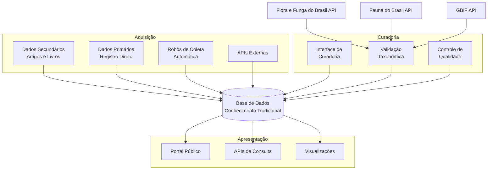
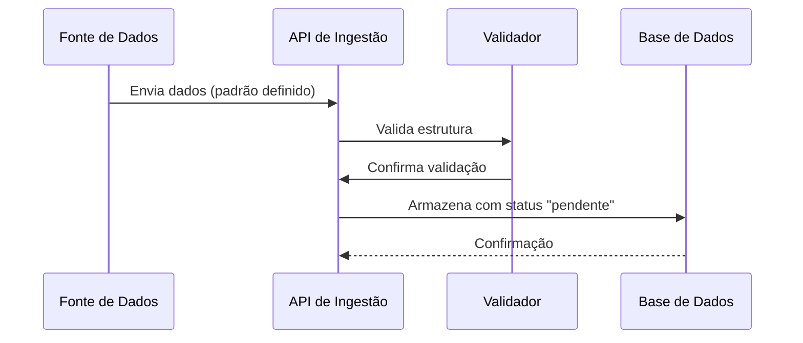
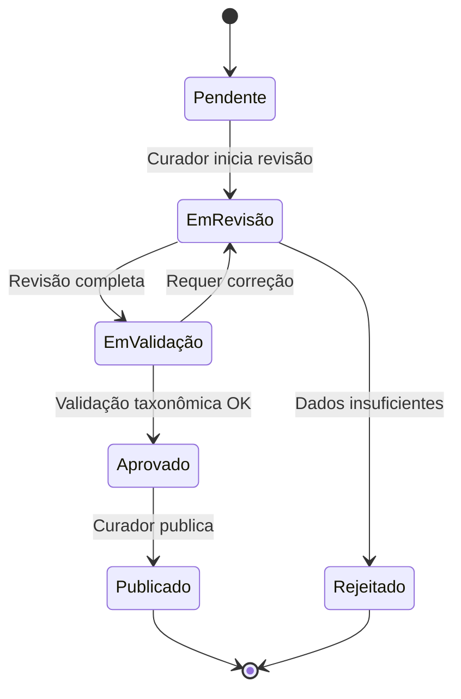

# Arquitetura para um Sistema de Informações sobre Conhecimento Tradicional Associado à Biodiversidade

[](https://doi.org/10.5281/zenodo.17714765)

## Visão Geral

Este repositório contém a proposta de arquitetura para um sistema de informações dedicado à preservação, curadoria e compartilhamento de conhecimento tradicional associado à biodiversidade. O sistema foi projetado com respeito aos princípios **C.A.R.E.** (Collective Benefit, Authority to Control, Responsibility, Ethics) e em conformidade com a legislação pertinente.

---

## Motivação e Justificativa

### O Cenário Atual: Fragmentação de Iniciativas

O Brasil possui múltiplas iniciativas de qualidade mundial para sistematizar conhecimento tradicional associado à biodiversidade, porém operam de forma isolada sem arquitetura comum que permita integração e sinergia:

#### 1. Projeto GEF "Entre-Ciências" (2025-2029)
Projeto de grande porte (US$ 80 milhões) coordenado pelo MCTI para fortalecer capacidade de Povos Indígenas e Comunidades Locais (PIPCTAFs) gerenciarem dados sobre sociobiodiversidade em Amazônia e Cerrado, usando padrões DarwinCore/PlinianCore via SiBBr.

#### 2. Rede de Conhecimentos sobre Sociobiodiversidade (RCS)
Iniciativa do ICMBio (CNPT) em parceria com UFSC que busca integrar bases de dados dispersas em plataforma única, com ênfase em protocolos comunitários e Consentimento Livre, Prévio e Informado (CLPI).

#### 3. Modernização do SISGEN (RNP-MMA-BID)
Projeto de 13 meses para modernizar o Sistema Nacional de Gestão do Patrimônio Genético e CTA, implementando interoperabilidade via IPT (Integrated Publishing Toolkit) com padrões FAIR e CARE.

#### 4. Useflora: Banco de Dados Etnobotânicos (UFSC)
Sistema com registros etnobotânicos validados, implementando inovador "Registro Comunitário" onde comunidades definem níveis de acesso a seus conhecimentos.

### O Problema da Fragmentação

Apesar de perseguirem objetivos convergentes, essas iniciativas geram:

- **Dispersão de dados**: mesmo conhecimento armazenado em múltiplos sistemas sem sincronização
- **Padrões inconsistentes**: Useflora (41 campos relacional), GEF (DarwinCore), SISGEN (patrimônio genético), RCS (agregador flexível)
- **Replicação de esforços**: múltiplos "registros comunitários" em desenvolvimento paralelo
- **Soberania fragmentada**: comunidades interagem com sistemas desconectados
- **Pesquisa limitada**: impossível fazer queries que atravessem iniciativas
- **Sustentabilidade em risco**: cada um com seu ciclo de financiamento e dependências

### Oportunidade de Integração

Uma arquitetura integrada possibilitaria:

✅ **Interoperabilidade sem perda de autonomia**: camada comum permite compartilhamento mantendo independência</br>
✅ **Registro comunitário unificado**: comunidade faz login uma única vez, direitos propagam para todas plataformas</br>
✅ **Governança consistente**: FAIR + CARE implementados uniformemente</br>
✅ **Busca e análise integrada**: pesquisadores com visão completa da biodiversidade</br>
✅ **Repartição de benefícios rastreável**: Lei 13.123/2015 cumprida efetivamente

### Imperativo Legal e Institucional

A fragmentação coloca em risco o cumprimento de:
- **Lei 13.123/2015**: comunidades precisam ser informadas sobre usos de conhecimento (impossível se disperso)
- **Protocolo de Nagoya**: exige rastreabilidade internacional (integração técnica essencial)
- **CDB Art. 8j**: participação ativa de detentores (integração facilitaria essa participação)

### Convergência das Iniciativas

Todas compartilham:
- Objetivo de sistematizar CTA
- Desafio de proteção do conhecimento tradicional
- Mesma base legal (Lei 13.123/2015)
- Compatibilidade técnica (SiBBr, infraestrutura de dados aberta, padrões interoperáveis)
- Cobertura geográfica complementar (juntas cobrem praticamente toda biodiversidade brasileira)

**Esta proposta de arquitetura não busca substituir as iniciativas existentes, mas criar camada de integração que possibilite interoperabilidade, estabeleça padrões mínimos sem sacrificar autonomia, e implemente governança compartilhada com protagonismo comunitário.**

---

## Objetivos

- **Preservar** o conhecimento tradicional de comunidades sobre o uso de plantas e biodiversidade
- **Validar** e qualificar dados através de processos curatoriais rigorosos
- **Compartilhar** informações de forma ética e responsável com pesquisadores e público geral
- **Integrar** múltiplas fontes de dados, desde artigos científicos até registros primários
- **Automatizar** a captura de informações relevantes de fontes confiáveis

## Arquitetura do Sistema

O sistema é organizado em **três contextos principais** que trabalham de forma integrada:



### Metodologia: C4 Model

A arquitetura deste sistema é documentada utilizando o **[C4 Model](https://c4model.com/)**, um framework de visualização que descreve arquiteturas de software através de 4 níveis de diagrama progressivamente mais detalhados (criado por Simon Brown):

1. **Context (Contexto)**: Visão de alto nível mostrando o sistema como uma caixa preta e suas interações com usuários e sistemas externos
2. **Container (Contêiner)**: Decomposição do sistema em contêineres tecnológicos (aplicações, bancos de dados, serviços) e como se comunicam
3. **Component (Componente)**: Detalhamento interno de cada contêiner, mostrando os componentes principais e suas responsabilidades
4. **Code (Código)**: Nível de detalhe de classes, interfaces e relações (opcional, utilizamos quando necessário)

Essa abordagem oferece clareza progressiva: iniciantes entendem o contexto geral, arquitetos visualizam containers e decisões técnicas, e desenvolvedores acessam detalhes de componentes. Os diagramas neste repositório seguem este padrão, permitindo navegação intuitiva da visão geral até a implementação.

### 1. Contexto de Aquisição

Responsável pela **entrada de dados** no sistema de múltiplas fontes:

- **Dados Secundários**: Extração de informações de artigos científicos, livros e publicações
- **Dados Primários**: Registro direto com todos os cuidados éticos e legais necessários
- **Coleta Automatizada**: Robôs que monitoram periódicos científicos (ex: etnobotânica)
- **Integrações**: APIs para consumo de dados de sistemas externos



**Características principais:**
- Padrão de dados unificado para todas as fontes
- APIs RESTful para ingestão
- Sistema de fila para processamento assíncrono
- Validação automática de dados taxonômicos via GBIF e Global Names

### 2. Contexto de Curadoria

Interface dedicada para **qualificação e validação** dos dados:

- Acesso restrito a pesquisadores e representantes de comunidades
- Workflow de aprovação e enriquecimento de dados
- Integração com APIs de validação taxonômica
- Controle de versões e auditoria de alterações



### 3. Contexto de Apresentação

Portal público para **acesso e consulta** das informações validadas:

- Interface web responsiva
- APIs públicas de consulta
- Visualizações interativas
- Sistema de busca avançada
- Exportação de dados em formatos abertos

## Tecnologias Consideradas

### Banco de Dados

Devido à **complexidade e flexibilidade** necessárias para armazenar conhecimento tradicional, três abordagens são consideradas:

1. **Bancos de Dados SQL** - Modelo relacional
   - Estrutura rigorosa com esquema bem definido
   - Integridade referencial garantida
   - Consultas poderosas em dados estruturados
   - Ideal para relacionamentos complexos

2. **Bancos Orientados a Documentos (JSON)**
   - Flexibilidade no esquema
   - Escalabilidade horizontal
   - Consultas ricas em documentos estruturados como JSON
   - Armazenamento natural de dados semi-estruturados

3. **Bancos Multi-Modais**
   - Suportam múltiplos modelos de dados (documentos, grafos, relações)
   - Permitem modelar relações complexas entre entidades
   - Query language moderna e versátil
   - Flexibilidade arquitetural para evolução futura

### Integrações Externas

- **Flora e Funga do Brasil API** (https://floradobrasil.jbrj.gov.br/consulta/) - Verificação primária de nomenclatura científica e validação de dados taxonômicos para plantas, algas e fungos brasileiros
- **Fauna do Brasil API** (https://fauna.jbrj.gov.br/) - Verificação primária de nomenclatura científica e validação de dados taxonômicos para fauna brasileira
- **GBIF API** (https://www.gbif.org/) - Validação de dados taxonômicos como fallback quando não encontrado nas bases brasileiras
- Periódicos científicos via APIs ou scraping ético

## Princípios Orientadores

### C.A.R.E. Principles

- **Collective Benefit**: Os dados devem beneficiar as comunidades que os originaram
- **Authority to Control**: Comunidades mantêm autoridade sobre seus conhecimentos
- **Responsibility**: Responsabilidade ética no manejo dos dados
- **Ethics**: Respeito às práticas éticas e culturais

### Legislação

O sistema respeita:
- Lei da Biodiversidade (Lei 13.123/2015)
- Protocolo de Nagoya
- Legislações locais sobre conhecimento tradicional

## Estrutura da Documentação

Este repositório está organizado da seguinte forma:

```
etnoArquitetura/
├── README.md (este arquivo)
├── docs/
│   ├── c4-model/
│   │   ├── 01-context-diagram.md
│   │   ├── 02-container-diagram.md
│   │   └── 03-component-diagram.md
│   ├── architecture-decisions/
│   │   ├── ADR-001-database-selection.md
│   │   ├── ADR-002-api-standards.md
│   │   └── ADR-003-data-model.md
│   └── diagrams/
│       ├── data-flow.md
│       └── integration-patterns.md
```

### Navegação da Documentação

1. **[Diagrama de Contexto](docs/c4-model/01-context-diagram.md)** - Visão de alto nível do sistema e seus usuários
2. **[Diagrama de Containers](docs/c4-model/02-container-diagram.md)** - Componentes principais e suas tecnologias
3. **[Diagrama de Componentes](docs/c4-model/03-component-diagram.md)** - Detalhamento interno de cada contexto
4. **[Decisões Arquiteturais](docs/architecture-decisions/)** - ADRs documentando escolhas técnicas

## Próximos Passos

1. Definição detalhada do modelo de dados
2. Prototipação das APIs de ingestão
3. Desenvolvimento do sistema de autenticação e autorização
4. Implementação do workflow de curadoria
5. Desenvolvimento da interface pública

---

## Integração com Referências e Iniciativas

### Arquitetura Inspirada em NIKMAS

A proposta de arquitetura incorpora lições aprendidas do projeto **NIKMAS (National Indigenous Knowledge Management System)** da África do Sul, especialmente:

- **Modelo de Dados Dual**: Preservação simultânea de artefatos originais (gravações audiovisuais, fotos) e estruturas de metadados formais para proteção legal
- **Arquitetura Distribuída**: Nó central com Pontos de Presença (PoPs) regionais para captura descentralizada e sincronização seletiva respeitando confidencialidade
- **Segurança Multi-Camadas**: Controle de acesso baseado em políticas (XACML) para proteção de conhecimento sensível
- **Catálogo de Detentores**: Base de dados de indivíduos e comunidades detentores de conhecimento com rastreamento de proveniência
- **Curadoria Estruturada**: Interface dedicada para especialistas validarem e anotarem dados

### Acesso via Comunicações Móveis

Reconhecendo que muitas comunidades tradicionais em áreas remotas têm acesso móvel limitado mas penetrante, a arquitetura prevê:

- **Aplicações Mobile Offline-First**: Captura de dados sem necessidade de conexão permanente
- **Integração SMS/USSD**: Acesso a informações via mensagens de texto para regiões com infraestrutura móvel limitada
- **WhatsApp Integration**: Suporte a plataforma popular para comunicação e consultas
- **Apps Comunitárias**: Desenvolvimento de aplicativos customizados para diferentes contextos culturais

Esta abordagem segue exemplos bem-sucedidos como **CyberTracker** e **MAPEO**, que demonstram o potencial de tecnologias móveis para empoderamento comunitário em monitoramento participativo.

### Validação e Certificação de Dados

O sistema implementa um **workflow robusto de validação** em múltiplas etapas:

1. **Validação Estrutural**: Verificação automática de conformidade com padrões de dados (Darwin Core, Plinian Core)
2. **Validação Taxonômica**: Integração com bases brasileiras (Flora e Funga para flora/fungos, Fauna para fauna) com fallback para GBIF API quando não encontrado nas bases brasileiras
3. **Curadoria Especializada**: Revisão por especialistas de domínio (botânicos, etnobólogos, farmacêuticos tradicionais)
4. **Validação Comunitária**: Participação de detentores de conhecimento na certificação de dados antes de publicação
5. **Rastreabilidade Completa**: Logs de auditoria de todas as mudanças e validações

### Aquisição de Dados Primários

Para coleta ética e consentida de dados diretamente das comunidades:

- **Processo CLPI (Consentimento Livre, Prévio e Informado)**: Implementação de protocolo completo baseado em Lei 13.123/2015
- **Registro Comunitário**: Interface para comunidades registrarem autonomamente seu próprio conhecimento
- **Acordos Eletrônicos**: Armazenamento e rastreamento de acordos de compartilhamento de benefícios
- **Infopreneurs Locais**: Capacitação de membros da comunidade como coletores de dados com oportunidades de geração de renda
- **Documentação Audiovisual**: Suporte a preservação de conhecimento em múltiplas formas (áudio, vídeo, foto, texto)

### Integração com Plataforma de Territórios Tradicionais do MPF

A arquitetura está projetada para **integração bidirecional** com a [Plataforma de Territórios Tradicionais](https://territoriostradicionais.mpf.mp.br/) do Ministério Público Federal:

- **Sincronização de Polígonos Territoriais**: Importação automática de limites geográficos de territórios indígenas e tradicionais
- **Cruzamento Espacial**: Associação de registros de conhecimento com territórios de origem
- **Rastreabilidade Geográfica**: Visualização interativa de onde conhecimentos são praticados
- **Dados Públicos do MPF**: Acesso a informações sobre status de demarcação, conflitos e historicamente de ocupação
- **API de Integração**: Endpoints REST para consulta e sincronização de dados territoriais

Esta integração fortalece:
- Rastreabilidade de conhecimento até sua origem territorial
- Suporte a processos de demarcação e regularização
- Monitoramento de ameaças a territórios que guardam conhecimento tradicional
- Conformidade com Lei 13.123/2015 sobre proveniência geográfica

### Padrões de Dados Abertos

A arquitetura adota e contribui para padrões de dados abertos reconhecidos:

- **Darwin Core**: Para ocorrências de espécies e dados de biodiversidade
- **Plinian Core**: Para descrições de espécies e informações sobre usos
- **Dublin Core Estendido**: Para metadados ricos e flexíveis
- **SocioBio Standard**: Padrão específico para dados de sociobiodiversidade brasileira (ver [projeto SocioBio no GitHub](https://github.com/sibbr/sociobio))

### Interoperabilidade com Sistemas Nacionais

Integração planejada com principais sistemas brasileiros:

- **SiBBr** (Sistema de Informação sobre Biodiversidade Brasileira): Nó brasileiro do GBIF
- **SisGen** (Sistema Nacional de Gestão do Patrimônio Genético): Rastreamento de acesso e repartição de benefícios
- **CNPq**: Integração com dados de pesquisadores e grupos de pesquisa
- **GBIF Global**: Contribuição de dados brasileiros para rede global de biodiversidade

---

## Iniciativas Relacionadas em Andamento (GitHub)

Esta proposta de arquitetura dialoga e se complementa com os seguintes projetos em desenvolvimento e disponíveis no GitHub:

### Dados da Sociobiodiversidade
- **[Useflora](https://github.com/nperoni/Useflora)** - Banco de dados etnobotânicos com registro comunitário onde comunidades definem níveis de acesso

### Padrões de Dados
- **[SocioBio](https://github.com/sibbr/sociobio)** - Padrão de dados para sociobiodiversidade brasileira, desenvolvido pelo SiBBr
- **[CESP SiBBr 2024](https://github.com/sibbr/cesp-sibbr-2024)** - Iniciativa de ciência aberta e interoperabilidade do Sistema de Informação sobre Biodiversidade Brasileira

### Vocabulários e Terminologia
- **[EtnoVocab](https://github.com/edalcin/etnovocab)** - Vocabulário controlado para termos etnobotânicos e etnobiológicos
- **[EtnoTermos](https://github.com/edalcin/etnotermos)** - Terminologia e glossário especializado para conhecimento tradicional
- **[EtnoVector](https://github.com/edalcin/etnovector)** - Vetorização e representação semântica de conceitos etnobotânicos

### Estruturas de Dados e Documentação
- **[Estrutura de Dados Etnobotânicos](https://github.com/edalcin/Estrutura-de-Dados-Etnobotanicos)** - Modelos e esquemas para armazenamento de informações etnobotânicas
- **[EtnoPapers](https://github.com/edalcin/etnopapers)** - Coleção de trabalhos e publicações sobre etnobiologia e conhecimento tradicional

Estes projetos complementares fornecem:
- Padrões de dados interoperáveis
- Vocabulários controlados para melhorar a qualidade dos dados
- Exemplos práticos de implementação
- Recursos para curadoria e validação de informações etnobotânicas

---

## Referências

Para a lista completa de referências bibliográficas organizadas segundo a norma **ABNT NBR 6023:2018** (padrão brasileiro), consulte [Referencias.md](Referencias.md).

Essa documentação incorpora referências a:
- Legislação brasileira e internacional relevante (Lei 13.123/2015, Protocolo de Nagoia, Convenção 169 OIT)
- Padrões de dados abertos (Darwin Core, Plinian Core, Dublin Core, SocioBio)
- Arquitetura de sistemas (NIKMAS, Fedora, OAIS)
- Governança de dados (FAIR, CARE)
- Tecnologias móveis (CyberTracker, MAPEO)
- Etnobiologia e conhecimento tradicional
- Iniciativas brasileiras práticas (GEF Entre-Ciências, SISGEN, Useflor@, RCS)
- Data sovereignty e consentimento livre, prévio e informado (CLPI)

---

## Citação

Se você usar esta proposta de arquitetura em seu trabalho, por favor cite como:

**APA:**
```
Dalcin, E. (2025). Arquitetura para um Sistema de Informações sobre Conhecimento Tradicional Associado à Biodiversidade - Versão 1.0 (Version v1.0) [Software documentation]. Zenodo. https://doi.org/10.5281/zenodo.17714765
```

**BibTeX:**
```bibtex
@software{dalcin2025,
  author = {Dalcin, Eduardo},
  title = {Arquitetura para um Sistema de Informações sobre Conhecimento Tradicional Associado à Biodiversidade - Versão 1.0},
  version = {v1.0},
  year = {2025},
  publisher = {Zenodo},
  doi = {10.5281/zenodo.17714765},
  url = {https://doi.org/10.5281/zenodo.17714765}
}
```

**DOI:** [10.5281/zenodo.17714765](https://doi.org/10.5281/zenodo.17714765)

---

## Contribuindo

Este é um projeto em fase de proposta. Contribuições e sugestões são bem-vindas através de issues e pull requests.

## Licença

A definir - considerando licenças que respeitem os princípios C.A.R.E. e protejam adequadamente o conhecimento tradicional.

## Contato

Para mais informações sobre este projeto, entre em contato através das issues deste repositório.
