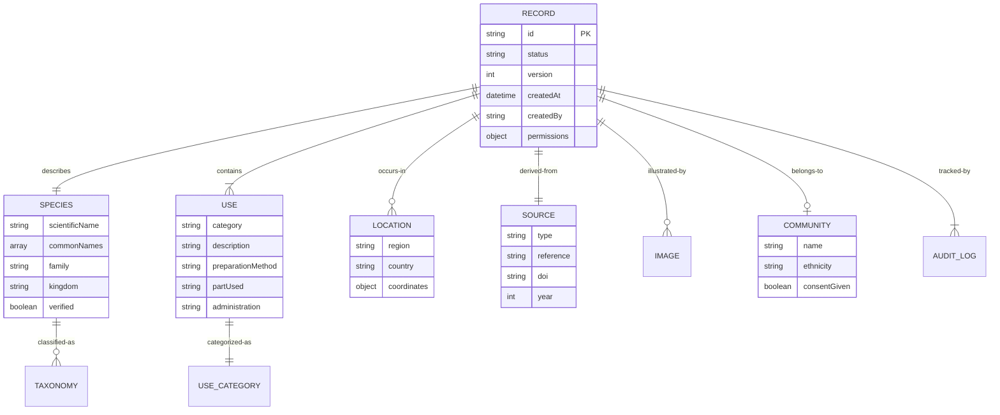

# ADR-003: Modelo de Dados para Conhecimento Tradicional

## Status
**Proposto** - Aguardando validação com comunidades e pesquisadores

## Contexto

Conhecimento tradicional associado à biodiversidade é intrinsecamente complexo e heterogêneo. Precisamos de um modelo de dados que:

1. **Respeite a Diversidade**: Diferentes comunidades têm diferentes formas de categorizar e descrever conhecimento
2. **Seja Flexível**: Novos tipos de conhecimento podem surgir
3. **Seja Interoperável**: Facilite integração com outras bases (GBIF, Darwin Core)
4. **Proteja Sensibilidades**: Suporte controles de acesso granulares
5. **Rastreie Proveniência**: Sempre saiba de onde veio cada informação

## Requisitos

### Funcionais
1. Armazenar dados taxonômicos (espécies, classificação)
2. Armazenar usos tradicionais (múltiplos por espécie)
3. Vincular a localizações geográficas
4. Registrar fontes (primárias e secundárias)
5. Controlar acesso por níveis de sensibilidade
6. Manter histórico de alterações (auditoria)

### Não-Funcionais
1. Conformidade com princípios C.A.R.E.
2. Compatibilidade com Darwin Core (quando possível)
3. Suporte a multilinguagem
4. Extensibilidade sem quebrar estrutura existente

## Decisão

Adotamos um **modelo híbrido** que combina:
- **Estrutura Core**: Campos obrigatórios padronizados
- **Extensões Flexíveis**: Campos customizados por tipo de conhecimento
- **Metadata Rica**: Proveniência, permissões e auditoria

### Modelo Conceitual



## Estrutura de Dados Detalhada

### 1. Registro Principal (Record)

Entidade central que representa um item de conhecimento tradicional.

```javascript
{
  // ============ IDENTIFICAÇÃO ============
  _id: ObjectId("507f1f77bcf86cd799439011"),
  type: "traditional_knowledge", // Fixo por enquanto, extensível no futuro

  // ============ WORKFLOW ============
  status: "published", // pending | in_review | in_validation | approved | published | rejected
  version: 3, // Incrementa a cada alteração

  // ============ DADOS TAXONÔMICOS ============
  species: {
    // Nome científico (nomenclatura binomial)
    scientificName: "Manihot esculenta Crantz",

    // Nomes populares (multilíngue)
    commonNames: [
      { name: "Mandioca", language: "pt-BR" },
      { name: "Cassava", language: "en" },
      { name: "Aipim", language: "pt-BR", region: "Sul do Brasil" },
      { name: "Macaxeira", language: "pt-BR", region: "Norte do Brasil" }
    ],

    // Classificação taxonômica
    taxonomy: {
      kingdom: "Plantae",
      phylum: "Tracheophyta",
      class: "Magnoliopsida",
      order: "Malpighiales",
      family: "Euphorbiaceae",
      genus: "Manihot",
      specificEpithet: "esculenta",
      scientificNameAuthorship: "Crantz"
    },

    // Validação externa
    validation: {
      gbif: {
        taxonKey: 5290063,
        matchType: "EXACT",
        confidence: 100,
        status: "ACCEPTED",
        lastValidated: ISODate("2025-01-15T10:00:00Z")
      },
      globalNames: {
        matchedName: "Manihot esculenta Crantz",
        score: 0.99,
        dataSource: "Catalogue of Life"
      }
    },

    // Indica se taxonomia foi validada por curador
    verified: true,

    // Sinônimos conhecidos
    synonyms: ["Manihot utilissima", "Janipha manihot"]
  },

  // ============ USOS TRADICIONAIS ============
  uses: [
    {
      id: "use_001", // ID interno do uso

      // Categoria padronizada
      category: "medicinal",
      // Valores: medicinal | food | ritual | construction | craft | veterinary | cosmetic | other

      // Descrição do uso (multilíngue)
      description: [
        { text: "Tratamento de feridas e inflamações", language: "pt-BR" },
        { text: "Treatment of wounds and inflammation", language: "en" }
      ],

      // Parte da planta utilizada
      partUsed: "folhas", // folhas | raiz | caule | flores | frutos | sementes | casca | seiva | planta inteira

      // Método de preparação
      preparationMethod: [
        { text: "Amassar folhas frescas até formar pasta", language: "pt-BR" }
      ],

      // Forma de administração
      administration: "tópica", // oral | tópica | inalação | banho | defumação

      // Dosagem (quando aplicável)
      dosage: "Aplicar 2x ao dia sobre a ferida",

      // Ailments tratados (para uso medicinal)
      ailments: [
        { name: "feridas", icd10: "T14.1" },
        { name: "inflamação" }
      ],

      // Indicações de segurança
      safety: {
        contraindications: ["Não aplicar em feridas profundas"],
        sideEffects: [],
        interactions: []
      },

      // Contexto cultural
      culturalContext: {
        seasonality: "Coletar folhas na lua crescente",
        rituals: "Benzer as folhas antes da aplicação",
        restrictions: "Uso exclusivo por mulheres da comunidade"
      },

      // Verificado por representante da comunidade
      verifiedByCommunity: true
    },

    {
      id: "use_002",
      category: "food",
      description: [
        { text: "Farinha para preparo de alimentos", language: "pt-BR" }
      ],
      partUsed: "raiz",
      preparationMethod: [
        { text: "Descascar, ralar e torrar a raiz", language: "pt-BR" }
      ],
      safety: {
        contraindications: ["Raiz deve ser processada para remover cianeto"],
        precautions: "Não consumir raiz crua"
      }
    }
  ],

  // ============ LOCALIZAÇÃO GEOGRÁFICA ============
  location: {
    // Descrição textual
    region: "Alto Rio Negro",
    locality: "Comunidade São Gabriel da Cachoeira",
    state: "Amazonas",
    country: "Brasil",
    countryCode: "BR",

    // Coordenadas geográficas (opcional)
    coordinates: {
      type: "Point",
      coordinates: [-67.0892, -0.1303] // [longitude, latitude] - Padrão GeoJSON
    },

    // Precisão (para proteção de locais sensíveis)
    precision: "approximate", // exact | approximate | region-only | withheld

    // Informações ecológicas
    habitat: "Floresta de terra firme",
    elevation: 90, // metros
    ecosystemType: "Floresta Amazônica"
  },

  // ============ COMUNIDADE (Opcional e Controlado) ============
  community: {
    // Informações só incluídas com consentimento explícito
    name: "Comunidade Baniwa do Rio Içana",
    ethnicity: "Baniwa",
    language: "Baniwa",

    // Consentimento documentado
    consent: {
      obtained: true,
      date: ISODate("2024-12-01T00:00:00Z"),
      type: "free_prior_informed", // FPIC - Free, Prior and Informed Consent
      document: "consent_form_001.pdf",
      authorizedBy: "Liderança Comunitária"
    },

    // Beneficiários (para implementar princípio C.A.R.E. de Collective Benefit)
    beneficiaries: [
      {
        type: "community",
        name: "Comunidade Baniwa do Rio Içana",
        share: 100 // Porcentagem de benefícios
      }
    ]
  },

  // ============ FONTE / PROVENIÊNCIA ============
  source: {
    type: "primary", // primary | secondary

    // Para fontes primárias (coleta direta)
    primary: {
      collectionMethod: "entrevista", // entrevista | observação | workshop-participativo
      collectedBy: ObjectId("user_id"), // Referência ao pesquisador
      collectionDate: ISODate("2024-11-15T00:00:00Z"),
      informants: [
        {
          role: "Pajé da comunidade",
          ageRange: "60-70",
          gender: "masculino",
          anonymized: true // Não incluir nome
        }
      ],
      ethicsApproval: {
        committee: "Comitê de Ética em Pesquisa - UFAM",
        protocol: "CAAE 12345678.9.0000.5020",
        approvalDate: ISODate("2024-10-01T00:00:00Z")
      }
    },

    // Para fontes secundárias (literatura)
    secondary: {
      reference: "Silva, J. et al. (2023). Plantas medicinais do Alto Rio Negro. Editora Amazônia.",
      doi: "10.1234/example.doi",
      isbn: "978-3-16-148410-0",
      url: "https://example.com/publication",
      year: 2023,
      pages: "45-67",
      publisher: "Editora Amazônia",

      // Extração de dados
      extractedBy: ObjectId("user_id"),
      extractionDate: ISODate("2025-01-10T00:00:00Z"),
      extractionMethod: "manual" // manual | automated-ocr | automated-nlp
    }
  },

  // ============ MÍDIA ASSOCIADA ============
  images: [
    {
      filename: "manihot_esculenta_001.jpg",
      caption: "Folhas da planta Manihot esculenta",
      credit: "Foto: Dr. João Silva",
      license: "CC BY-SA 4.0",
      url: "https://cdn.etnoknowledge.org/images/species/507f.../001.jpg",
      uploadDate: ISODate("2025-01-15T00:00:00Z")
    }
  ],

  // Vídeos, áudios, etc. (futuro)
  media: [],

  // ============ CONTROLE DE ACESSO ============
  permissions: {
    // Nível de visibilidade
    visibility: "public", // public | restricted | private | community-only

    // Para registros restritos
    restrictions: {
      reason: "Conhecimento sagrado da comunidade",
      allowedRoles: ["admin", "community_rep"],
      allowedUsers: [ObjectId("user_1"), ObjectId("user_2")],
      allowedCommunities: [ObjectId("community_1")]
    },

    // Campos que devem ser ocultados publicamente
    hiddenFields: ["location.coordinates", "community.name"],

    // Licença de uso
    license: "CC BY-NC-SA 4.0", // Permitir uso não comercial com atribuição
    attribution: "Comunidade Baniwa do Rio Içana, 2024"
  },

  // ============ METADADOS DO SISTEMA ============
  metadata: {
    createdAt: ISODate("2025-01-15T10:30:00Z"),
    createdBy: ObjectId("user_researcher_123"),
    lastModifiedAt: ISODate("2025-01-20T14:20:00Z"),
    lastModifiedBy: ObjectId("user_curator_456"),
    publishedAt: ISODate("2025-01-21T09:00:00Z"),
    publishedBy: ObjectId("user_admin_789"),

    // Idioma principal do registro
    language: "pt-BR",

    // Tags para facilitar busca
    tags: ["etnobotânica", "medicina tradicional", "Amazônia", "Baniwa"],

    // Qualidade dos dados (0-100)
    qualityScore: 95,

    // Indicadores de completude
    completeness: {
      taxonomyValidated: true,
      communityConsent: true,
      geolocationProvided: true,
      imagesProvided: true,
      multilingualDescriptions: false
    }
  },

  // ============ EXTENSÕES CUSTOMIZADAS ============
  // Espaço para campos específicos de projetos ou comunidades
  extensions: {
    // Exemplo: Projeto específico
    projectABC: {
      projectId: "proj_123",
      customField1: "valor",
      customField2: 42
    }
  }
}
```

---

## Entidades Relacionadas

### 2. Usuários (Users)

```javascript
{
  _id: ObjectId("user_123"),
  email: "researcher@example.com",
  name: "Dr. João Silva",

  // Papel no sistema
  role: "curator", // researcher | curator | admin | community_rep | developer

  // Instituição
  institution: {
    name: "Universidade Federal do Amazonas",
    type: "university", // university | ngo | government | indigenous-organization
    country: "Brasil"
  },

  // Para representantes de comunidade
  community: {
    communityId: ObjectId("community_123"),
    role: "liderança", // liderança | pajé | artesão | etc
    authorized: true
  },

  // Permissões específicas
  permissions: ["read", "write", "approve", "delete"],

  // Preferências
  preferences: {
    language: "pt-BR",
    timezone: "America/Manaus",
    notifications: {
      email: true,
      inApp: true
    }
  },

  // Estatísticas
  stats: {
    recordsCreated: 45,
    recordsApproved: 120,
    lastActive: ISODate("2025-01-20T10:00:00Z")
  },

  createdAt: ISODate("2024-01-01T00:00:00Z"),
  active: true
}
```

### 3. Comunidades (Communities)

```javascript
{
  _id: ObjectId("community_123"),

  // Informações básicas
  name: "Comunidade Baniwa do Rio Içana",
  ethnicity: "Baniwa",
  language: "Baniwa",

  // Localização
  location: {
    region: "Alto Rio Negro",
    state: "Amazonas",
    country: "Brasil",
    coordinates: {
      type: "Polygon",
      coordinates: [[/* polígono da terra indígena */]]
    }
  },

  // Contatos autorizados
  contacts: [
    {
      name: "Nome do Representante",
      role: "liderança",
      email: "contato@example.com",
      userId: ObjectId("user_456")
    }
  ],

  // Estatísticas
  stats: {
    recordsContributed: 78,
    speciesDocumented: 42
  },

  // Metadados
  registeredAt: ISODate("2024-06-01T00:00:00Z"),
  verified: true
}
```

### 4. Logs de Auditoria (Audit Logs)

```javascript
{
  _id: ObjectId("log_123"),
  recordId: ObjectId("record_123"),

  // Versionamento
  versionNumber: 3,

  // Ação realizada
  action: "update", // create | update | approve | reject | publish | delete

  // Quem fez
  userId: ObjectId("user_456"),
  userName: "Dr. João Silva",
  userRole: "curator",

  // Quando
  timestamp: ISODate("2025-01-20T14:20:00Z"),

  // O que mudou
  changes: [
    {
      field: "species.scientificName",
      oldValue: "Manihot esculenta",
      newValue: "Manihot esculenta Crantz",
      reason: "Adicionado autor da espécie após validação GBIF"
    },
    {
      field: "species.validated",
      oldValue: false,
      newValue: true
    }
  ],

  // Snapshot completo (para rollback)
  snapshot: {
    /* cópia completa do documento antes da mudança */
  },

  // Comentários
  comments: "Validação taxonômica aprovada. Nome científico atualizado com autoria.",

  // Metadados
  ipAddress: "192.168.1.100",
  userAgent: "Mozilla/5.0..."
}
```

---

## Padrões de Nomenclatura

### Campos Obrigatórios (Core)

Todo registro DEVE ter:
- `species.scientificName`
- `uses` (mínimo 1)
- `source.type`
- `metadata.createdBy`

### Campos Recomendados

Para qualidade máxima:
- `species.taxonomy` (classificação completa)
- `species.validation` (validação externa)
- `uses[].preparationMethod`
- `location.coordinates`
- `source.primary.ethicsApproval` (para dados primários)
- `community.consent` (quando aplicável)

### Campos Opcionais

Enriquecem o registro:
- `images`
- `community` (sensível)
- `uses[].culturalContext`
- `extensions`

---

## Controle de Acesso Granular

### Níveis de Visibilidade

1. **public**: Qualquer pessoa pode acessar
2. **restricted**: Apenas usuários autenticados com permissão
3. **private**: Apenas criador e administradores
4. **community-only**: Apenas membros da comunidade associada

### Ocultação de Campos

Mesmo em registros públicos, certos campos podem ser ocultados:

```javascript
permissions: {
  visibility: "public",
  hiddenFields: [
    "location.coordinates",      // Ocultar localização exata
    "community.name",             // Ocultar identidade da comunidade
    "source.primary.informants"   // Ocultar identidade de informantes
  ]
}
```

### Exemplo de Aplicação

Registro completo (visão de curador):
```javascript
{
  species: { scientificName: "Banisteriopsis caapi" },
  community: { name: "Comunidade XYZ", ethnicity: "Huni Kuin" },
  location: {
    coordinates: { type: "Point", coordinates: [-70.123, -8.456] }
  }
}
```

Registro público (visão externa):
```javascript
{
  species: { scientificName: "Banisteriopsis caapi" },
  community: { ethnicity: "Huni Kuin" }, // Nome ocultado
  location: {
    region: "Acre",
    country: "Brasil"
    // Coordenadas ocultadas
  }
}
```

---

## Interoperabilidade

### Compatibilidade com Darwin Core

Mapeamento para padrão Darwin Core (usado por GBIF):

| Campo Darwin Core | Campo do Sistema |
|-------------------|------------------|
| `scientificName` | `species.scientificName` |
| `family` | `species.taxonomy.family` |
| `kingdom` | `species.taxonomy.kingdom` |
| `decimalLatitude` | `location.coordinates.coordinates[1]` |
| `decimalLongitude` | `location.coordinates.coordinates[0]` |
| `country` | `location.country` |
| `recordedBy` | `source.primary.collectedBy` |
| `eventDate` | `source.primary.collectionDate` |
| `vernacularName` | `species.commonNames[].name` |

### Export em Darwin Core Archive

Geração automática para intercâmbio:

```xml
<archive>
  <core rowType="http://rs.tdwg.org/dwc/terms/Occurrence">
    <field term="scientificName"/>
    <field term="family"/>
    <field term="decimalLatitude"/>
    <field term="decimalLongitude"/>
    ...
  </core>
</archive>
```

---

## Multilinguagem

### Estratégia

Campos de texto livre suportam arrays com idioma:

```javascript
description: [
  { text: "Descrição em português", language: "pt-BR" },
  { text: "Description in English", language: "en" },
  { text: "Descripción en español", language: "es" }
]
```

### Idiomas Prioritários

1. Português (pt-BR)
2. Inglês (en)
3. Espanhol (es)
4. Idiomas indígenas locais (quando disponível)

---

## Validações

### No Momento da Criação

1. **Schema Validation**: JSON Schema obrigatório
2. **Taxonomia**: Validar contra GBIF (warning se não encontrado)
3. **Coordenadas**: Validar formato GeoJSON
4. **Duplicação**: Verificar registros similares

### No Momento da Curadoria

1. **Completude**: Verificar campos recomendados
2. **Qualidade**: Calcular score de qualidade
3. **Ética**: Verificar consentimento (para dados primários)
4. **Taxonomia**: Re-validar periodicamente

---

## Consequências

### Positivas
- Modelo flexível que respeita diversidade cultural
- Controle de acesso robusto protege conhecimento sensível
- Interoperável com padrões internacionais
- Rastreabilidade completa de alterações

### Negativas
- Complexidade pode dificultar entrada de dados
- Requer treinamento de usuários
- Campos multilíngue aumentam tamanho do banco

### Mitigações
- Interfaces simplificadas com campos obrigatórios apenas
- Wizards guiados para criação de registros
- Tradução assistida por IA (futuro)

---

## Extensões Futuras

1. **Conhecimento de Fauna**: Adaptar modelo para animais
2. **Práticas Agrícolas**: Sistemas de cultivo tradicionais
3. **Artesanato**: Técnicas e materiais
4. **Narrativas Orais**: Histórias e mitos associados

---

## Referências

- [Darwin Core Standard](https://dwc.tdwg.org/)
- [C.A.R.E. Principles for Indigenous Data Governance](https://www.gida-global.org/care)
- [GBIF Data Quality Requirements](https://www.gbif.org/data-quality-requirements)
- [GeoJSON Specification](https://geojson.org/)

## Data de Revisão

**Próxima Revisão**: Após piloto com 3 comunidades (estimado: 6 meses)
