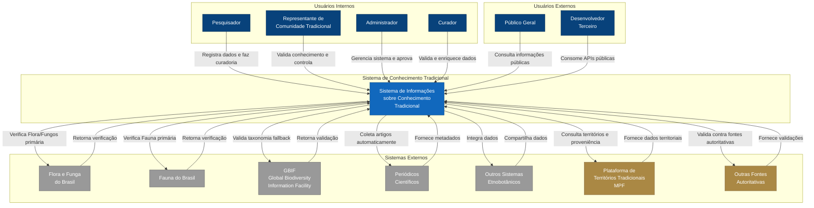

# C4 Model - Level 1: Diagrama de Contexto

## Visão Geral

O Diagrama de Contexto apresenta a visão de mais alto nível do Sistema de Informações sobre Conhecimento Tradicional, mostrando como ele se relaciona com os usuários e sistemas externos.

## Diagrama

## Atores

### Usuários Internos (Autenticados)

#### 1. Pesquisador
**Responsabilidades:**
- Registrar dados primários coletados em campo
- Inserir dados secundários extraídos de literatura científica
- Participar do processo de curadoria
- Validar informações taxonômicas

**Necessidades:**
- Interface para entrada estruturada de dados
- Ferramentas de validação em tempo real
- Histórico de contribuições
- Conformidade com protocolos éticos

#### 2. Representante de Comunidade Tradicional
**Responsabilidades:**
- Validar conhecimento tradicional registrado
- Exercer autoridade sobre dados da comunidade
- Aprovar ou rejeitar publicação de informações sensíveis
- Garantir benefício coletivo

**Necessidades:**
- Interface acessível e multilíngue
- Controle granular de permissões
- Transparência sobre uso dos dados
- Mecanismos de consentimento informado

#### 3. Curador
**Responsabilidades:**
- Revisar qualidade dos dados submetidos
- Enriquecer informações com validações externas
- Padronizar nomenclatura e taxonomia
- Aprovar publicação de dados validados

**Necessidades:**
- Dashboard de workflow de curadoria
- Integração com APIs de validação
- Ferramentas de edição colaborativa
- Sistema de notificações

#### 4. Administrador
**Responsabilidades:**
- Gerenciar usuários e permissões
- Configurar robôs de coleta automática
- Monitorar integridade do sistema
- Gerar relatórios e métricas

**Necessidades:**
- Painel administrativo completo
- Logs de auditoria
- Ferramentas de monitoramento
- Controle de configurações

### Usuários Externos (Públicos)

#### 5. Público Geral
**Responsabilidades:**
- Consultar conhecimento tradicional publicado
- Navegar e explorar dados
- Exportar informações em formatos abertos

**Necessidades:**
- Interface intuitiva de busca
- Visualizações interativas
- Acesso sem necessidade de cadastro
- Documentação clara sobre uso ético

#### 6. Desenvolvedor Terceiro
**Responsabilidades:**
- Integrar dados em aplicações externas
- Construir ferramentas complementares
- Contribuir com análises e visualizações

**Necessidades:**
- APIs RESTful bem documentadas
- Chaves de API para rate limiting
- Exemplos de código
- Suporte técnico

## Sistemas Externos

### 1. GBIF (Global Biodiversity Information Facility)
**URL:** https://www.gbif.org/

**Propósito:** Validação de dados taxonômicos

**Integração:**
- API REST para verificação de espécies
- Validação de nomenclatura científica
- Obtenção de dados de distribuição geográfica
- Enriquecimento com informações complementares

**Dados Consumidos:**
- Nome científico da espécie
- Classificação taxonômica
- Status de conservação

### 2. Flora e Funga do Brasil
**URL:** https://floradobrasil.jbrj.gov.br/consulta/

**Propósito:** Verificação primária de nomenclatura científica para plantas, algas e fungos brasileiros

**Integração:**
- API REST para busca de nomenclatura
- Validação contra base de dados oficial brasileira
- Dados de distribuição geográfica
- Informações sobre status de conservação

**Dados Consumidos:**
- Nomes científicos (verificação individual ou em lote)
- Informações taxonômicas completas
- Status de validação

### 3. Fauna do Brasil
**URL:** https://fauna.jbrj.gov.br/

**Propósito:** Verificação primária de nomenclatura científica para fauna brasileira

**Integração:**
- API REST para busca de nomenclatura da fauna
- Validação contra catálogo taxonômico oficial brasileiro
- Dados de distribuição geográfica
- Informações sobre status de conservação

**Dados Consumidos:**
- Nomes científicos de fauna (verificação individual ou em lote)
- Informações taxonômicas completas para animais
- Status de validação

**Estratégia:**
- Para flora/fungos: Flora e Funga do Brasil (validação primária)
- Para fauna: Fauna do Brasil (validação primária)
- Para ambos: GBIF (fallback quando não encontrado nas bases brasileiras)

### 4. Periódicos Científicos
**Exemplos:** Journal of Ethnobiology, Economic Botany, Ethnobotany Research

**Propósito:** Coleta automatizada de artigos relevantes

**Integração:**
- Web scraping ético (respeitando robots.txt)
- APIs de publishers (quando disponíveis)
- RSS feeds
- DOI resolution

**Dados Consumidos:**
- Metadados de publicações
- Resumos (abstracts)
- Referências bibliográficas
- Dados estruturados (quando disponíveis)

### 4. Outros Sistemas Etnobotânicos
**Exemplos:** Bases de dados regionais, repositórios institucionais

**Propósito:** Intercâmbio de dados

**Integração:**
- APIs customizadas
- Protocolos de interoperabilidade (OAI-PMH, GraphQL)
- Exportação/importação em formatos padrão

**Dados Compartilhados:**
- Registros de conhecimento tradicional
- Dados de ocorrência de espécies
- Informações etnobotânicas

### 5. Plataforma de Territórios Tradicionais (MPF)
**URL:** https://territoriostradicionais.mpf.mp.br/

**Propósito:** Sincronização de dados territoriais e proveniência geográfica do conhecimento tradicional

**Integração:**
- API REST para consulta de polígonos territoriais
- Sincronização automática de limites geográficos
- Cruzamento espacial de registros com territórios
- Acesso a dados públicos sobre status de demarcação

**Dados Consumidos:**
- Polígonos geográficos de territórios indígenas e tradicionais
- Metadados sobre povos e comunidades
- Status de demarcação e regularização
- Informações históricas sobre conflitos territoriais

**Utilidade no Sistema:**
- Validar proveniência geográfica do conhecimento
- Associar registros a territórios de origem
- Rastrear conhecimento até sua comunidade detentora
- Conformidade com Lei 13.123/2015 sobre proveniência

### 6. Outras Fontes Autoritativas
**Exemplos:** Plataformas especializadas, bases de dados comunitárias, registros públicos

**Propósito:** Validação e enriquecimento complementar de dados

**Integração:**
- APIs variadas dependendo da fonte
- Padrão genérico para novas integrações
- Priorização de validação (cascata configurável)

**Dados Consumidos:**
- Informações sobre conhecimento tradicional
- Validações de nomenclatura especializada
- Dados culturais e etnobotânicos
- Informações comunitárias certificadas

**Estratégia:**
- Permitem extensibilidade do sistema
- Suportam casos de uso específicos por região/comunidade
- Mantêm flexibilidade arquitetural

## Fluxos Principais

### Fluxo 1: Aquisição de Dados Primários
1. Pesquisador ou Representante autentica no sistema
2. Preenche formulário estruturado de registro
3. Sistema valida dados contra bases brasileiras (Flora e Funga para flora/fungos, Fauna para fauna) com fallback GBIF
4. Dados são armazenados com status "pendente"
5. Curador é notificado para revisão

### Fluxo 2: Aquisição Automática de Dados Secundários
1. Robô monitora periódicos científicos (agendamento)
2. Identifica artigos relevantes por palavras-chave
3. Extrai metadados e resumos
4. Sistema valida informações extraídas
5. Administrador recebe relatório para aprovação
6. Dados aprovados vão para fila de curadoria

### Fluxo 3: Curadoria e Validação
1. Curador acessa dashboard de itens pendentes
2. Revisa dados submetidos
3. Sistema executa validações automáticas:
   - Validação taxonômica (Flora/Fauna do Brasil com fallback GBIF)
   - Validação territorial (cruzamento com Plataforma de Territórios Tradicionais)
   - Validações contra outras fontes autoritativas
4. Curador enriquece e corrige informações
5. Representante de comunidade valida (se aplicável)
6. Curador aprova publicação
7. Dados se tornam públicos com rastreabilidade completa de proveniência

### Fluxo 4: Consulta Pública
1. Usuário público acessa portal
2. Realiza busca por espécie, região, ou uso
3. Sistema retorna resultados validados
4. Usuário visualiza detalhes e relacionamentos
5. Exporta dados em formato aberto (JSON, CSV)

### Fluxo 5: Integração via API
1. Desenvolvedor obtém chave de API
2. Consulta documentação da API
3. Faz requisições HTTP para endpoints públicos
4. Sistema retorna dados em JSON
5. Desenvolvedor integra em aplicação terceira

## Requisitos Não-Funcionais

### Segurança
- Autenticação robusta (OAuth 2.0, JWT)
- Autorização baseada em papéis (RBAC)
- Criptografia de dados sensíveis
- Auditoria completa de acessos

### Performance
- Tempo de resposta < 2s para consultas simples
- Suporte a 1000 requisições/minuto na API pública
- Processamento assíncrono para tarefas pesadas

### Escalabilidade
- Arquitetura horizontal para suportar crescimento
- Cache distribuído para dados públicos
- Fila de mensagens para processamento

### Disponibilidade
- Uptime de 99.5%
- Backup diário com retenção de 30 dias
- Plano de recuperação de desastres

### Conformidade
- LGPD (Lei Geral de Proteção de Dados)
- Lei da Biodiversidade (Lei 13.123/2015)
- Protocolo de Nagoya
- Princípios C.A.R.E.

## Premissas e Restrições

### Premissas
- Acesso à internet para validações externas
- Disponibilidade das APIs Flora e Funga do Brasil, Fauna do Brasil e GBIF
- Colaboração ativa de comunidades tradicionais
- Pesquisadores capacitados para entrada de dados

### Restrições
- Dados sensíveis não podem ser públicos sem autorização
- Sistema deve funcionar com conectividade limitada (offline-first para coleta)
- Multilinguagem essencial (português, inglês, idiomas indígenas)
- Acessibilidade (WCAG 2.1 nível AA)

## Riscos e Mitigações

| Risco | Impacto | Probabilidade | Mitigação |
|-------|---------|---------------|-----------|
| Indisponibilidade de APIs externas | Médio | Baixa | Cache local, validação assíncrona |
| Dados sensíveis vazados | Alto | Baixa | Criptografia, auditoria, controle rígido |
| Baixa adesão de comunidades | Alto | Média | Interface acessível, treinamento, benefícios claros |
| Qualidade dos dados automatizados | Médio | Alta | Workflow de validação obrigatório |

## Decisões de Arquitetura

Decisões detalhadas estão documentadas em [Architecture Decision Records (ADRs)](../architecture-decisions/):

- [ADR-001: Seleção de Banco de Dados](../architecture-decisions/ADR-001-database-selection.md)
- [ADR-002: Padrões de API](../architecture-decisions/ADR-002-api-standards.md)
- [ADR-003: Modelo de Dados](../architecture-decisions/ADR-003-data-model.md)

## Próximos Passos

Para entender como o sistema é dividido internamente, consulte:
- [Diagrama de Containers (Level 2)](02-container-diagram.md) - Detalhamento técnico dos componentes
