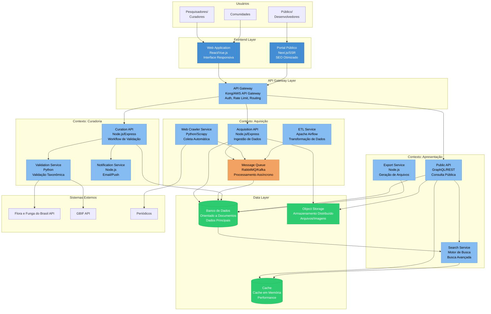

# C4 Model - Level 2: Diagrama de Containers

## Visão Geral

O Diagrama de Containers detalha os componentes técnicos que compõem o Sistema de Conhecimento Tradicional. Cada container representa uma aplicação ou serviço que executa de forma independente.

## Diagrama de Arquitetura



## Containers Detalhados

### Frontend Layer

#### 1. Web Application (Interface Interna)
**Tecnologia:** React.js ou Vue.js com TypeScript

**Responsabilidades:**
- Interface para pesquisadores registrarem dados
- Dashboard de curadoria
- Painel administrativo
- Gestão de permissões

**Características Técnicas:**
- SPA (Single Page Application)
- Estado gerenciado com Redux/Vuex/Pinia
- Comunicação via REST/GraphQL
- Autenticação JWT
- Suporte offline (PWA)

**Endpoints Consumidos:**
- `POST /api/acquisition/records` - Criar registros
- `GET /api/curation/pending` - Listar itens pendentes
- `PUT /api/curation/records/:id` - Atualizar registro
- `POST /api/curation/approve/:id` - Aprovar publicação

**Dependências:**
- API Gateway
- Authentication Service

#### 2. Portal Público
**Tecnologia:** Next.js (React SSR) ou Nuxt.js (Vue SSR)

**Responsabilidades:**
- Consulta pública de dados validados
- Visualizações interativas
- Sistema de busca
- Exportação de dados

**Características Técnicas:**
- Server-Side Rendering (SEO)
- Static Site Generation para páginas estáticas
- Infinite scroll para listagens
- Mapas interativos (Leaflet/Mapbox)
- Gráficos (D3.js/Chart.js)

**Endpoints Consumidos:**
- `GET /api/public/search` - Busca geral
- `GET /api/public/species/:id` - Detalhes de espécie
- `GET /api/public/regions` - Dados por região
- `POST /api/public/export` - Exportar dados

### API Gateway Layer

#### API Gateway
**Tecnologia:** Kong, AWS API Gateway, ou Express Gateway

**Responsabilidades:**
- Roteamento centralizado
- Autenticação e autorização
- Rate limiting
- CORS
- Logging e monitoring
- Cache de respostas

**Características Técnicas:**
- Proxy reverso
- Load balancing
- Circuit breaker
- Request/response transformation
- Analytics

**Configurações:**
- Rate limit: 1000 req/min para autenticados, 100 req/min para públicos
- Timeout: 30s para APIs, 5min para exports
- Retry policy: 3 tentativas com backoff exponencial

### Contexto: Aquisição

#### 3. Acquisition API
**Tecnologia:** Node.js com Express ou Fastify

**Responsabilidades:**
- Receber dados de múltiplas fontes
- Validar estrutura de dados (JSON Schema)
- Enfileirar para processamento
- Fornecer feedback ao submissor

**Endpoints:**
```
POST   /api/acquisition/records              - Criar registro
POST   /api/acquisition/bulk                 - Criar múltiplos registros
GET    /api/acquisition/status/:id           - Status do processamento
POST   /api/acquisition/validate             - Validar antes de enviar
GET    /api/acquisition/sources              - Listar fontes integradas
```

**Validações:**
- Schema validation (Joi/Yup)
- Deduplicação básica
- Verificação de campos obrigatórios

#### 4. Web Crawler Service
**Tecnologia:** Python com Scrapy ou Beautiful Soup

**Responsabilidades:**
- Monitorar periódicos científicos
- Extrair metadados de artigos
- Identificar artigos relevantes
- Respeitar robots.txt e rate limits

**Características Técnicas:**
- Agendamento via cron jobs
- User-agent identificável
- Delay entre requisições
- Armazenamento de estado (último crawl)

**Fontes Monitoradas:**
- Journal of Ethnobiology
- Economic Botany
- Journal of Ethnopharmacology
- PubMed (via API)
- SciELO

**Saída:**
```json
{
  "source": "journal_name",
  "title": "Article title",
  "authors": ["Author 1", "Author 2"],
  "abstract": "...",
  "doi": "10.xxxx/xxxxx",
  "keywords": ["ethnobotany", "traditional knowledge"],
  "published_date": "2025-01-15"
}
```

#### 5. ETL Service
**Tecnologia:** Apache Airflow ou Prefect

**Responsabilidades:**
- Transformar dados de diferentes formatos
- Normalizar estruturas
- Executar validações complexas
- Carregar no banco principal

**DAGs (Directed Acyclic Graphs):**
1. **Daily Crawl Pipeline**
   - Extract: Crawler coleta dados
   - Transform: Normalização e validação
   - Load: Inserção no DB com status "pendente"

2. **Bulk Import Pipeline**
   - Extract: Leitura de arquivos (CSV, Excel, JSON)
   - Transform: Mapeamento para schema padrão
   - Load: Validação e inserção

3. **Integration Pipeline**
   - Extract: Consumo de APIs externas
   - Transform: Conversão de formato
   - Load: Merge com dados existentes

#### 6. Message Queue
**Tecnologia:** RabbitMQ ou Apache Kafka

**Responsabilidades:**
- Desacoplar serviços
- Garantir processamento assíncrono
- Retry automático em caso de falha
- Dead letter queue para erros

**Filas:**
- `acquisition.new` - Novos registros
- `acquisition.validation` - Validação pendente
- `curation.notify` - Notificações para curadores
- `export.generate` - Geração de exports

### Contexto: Curadoria

#### 7. Curation API
**Tecnologia:** Node.js com Express

**Responsabilidades:**
- Gerenciar workflow de curadoria
- Atribuir tarefas a curadores
- Controlar versões de registros
- Aprovar/rejeitar publicações

**Endpoints:**
```
GET    /api/curation/dashboard              - Dashboard do curador
GET    /api/curation/pending                - Itens pendentes
GET    /api/curation/records/:id            - Detalhes do registro
PUT    /api/curation/records/:id            - Atualizar registro
POST   /api/curation/records/:id/validate   - Validar taxonomia
POST   /api/curation/records/:id/approve    - Aprovar
POST   /api/curation/records/:id/reject     - Rejeitar
GET    /api/curation/records/:id/history    - Histórico de alterações
POST   /api/curation/records/:id/assign     - Atribuir a curador
```

**Estados de Workflow:**
```
Pendente → Em Revisão → Em Validação → Aprovado → Publicado
                    ↓
                Rejeitado
```

#### 8. Validation Service
**Tecnologia:** Python com Flask ou FastAPI

**Responsabilidades:**
- Validar nomes científicos via Flora e Funga do Brasil (primária)
- Verificar nomenclatura via GBIF (fallback)
- Enriquecer com dados taxonômicos
- Sugerir correções

**Endpoints:**
```
POST   /api/validation/taxonomy             - Validar taxonomia
POST   /api/validation/names                - Verificar nomenclatura
POST   /api/validation/batch                - Validação em lote
GET    /api/validation/suggestions/:name    - Sugestões de correção
```

**Integração Externa:**
```python
# Flora e Funga do Brasil (primária)
GET https://floradobrasil.jbrj.gov.br/api/v1/search?name={scientific_name}

# GBIF Species Match (fallback)
GET https://api.gbif.org/v1/species/match?name={scientific_name}
```

**Estratégia de Validação:**
1. Tenta encontrar na Flora e Funga do Brasil
2. Se não encontrado, fallback para GBIF
3. Retorna dados taxonômicos enriquecidos

**Response Enrichment:**
```json
{
  "original_name": "Manihot esculenta",
  "matched_name": "Manihot esculenta Crantz",
  "status": "ACCEPTED",
  "confidence": 95,
  "taxon_key": 5290063,
  "kingdom": "Plantae",
  "family": "Euphorbiaceae",
  "common_names": ["Cassava", "Mandioca"]
}
```

#### 9. Notification Service
**Tecnologia:** Node.js

**Responsabilidades:**
- Enviar emails
- Push notifications
- Notificações in-app
- Logs de notificações

**Canais:**
- Email (SendGrid/AWS SES)
- Push (Firebase Cloud Messaging)
- WebSocket (real-time updates)

**Tipos de Notificação:**
- Novo item para curadoria
- Registro aprovado/rejeitado
- Comentário em registro
- Atribuição de tarefa

### Contexto: Apresentação

#### 10. Public API
**Tecnologia:** Node.js com GraphQL (Apollo Server) ou REST

**Responsabilidades:**
- Fornecer dados públicos
- Suportar consultas complexas
- Cache agressivo
- Documentação automática (Swagger/GraphQL Playground)

**GraphQL Schema (exemplo):**
```graphql
type Species {
  id: ID!
  scientificName: String!
  commonNames: [String!]!
  family: String
  uses: [TraditionalUse!]!
  regions: [Region!]!
  images: [Image!]
}

type TraditionalUse {
  description: String!
  community: String
  source: Source!
  verified: Boolean!
}

type Query {
  species(id: ID!): Species
  searchSpecies(name: String, family: String, region: String): [Species!]!
  speciesByUse(use: String!): [Species!]!
}
```

**REST Endpoints (alternativo):**
```
GET    /api/public/species                  - Listar espécies
GET    /api/public/species/:id              - Detalhes
GET    /api/public/search?q={query}         - Busca geral
GET    /api/public/uses                     - Listar usos tradicionais
GET    /api/public/regions                  - Listar regiões
GET    /api/public/stats                    - Estatísticas gerais
```

#### 11. Search Service
**Tecnologia:** Motor de busca especializado (ex: full-text search)

**Responsabilidades:**
- Indexação de documentos
- Busca full-text
- Faceted search
- Autocomplete
- Relevância ajustada

**Índices:**
- `species` - Dados de espécies
- `uses` - Usos tradicionais
- `communities` - Comunidades (dados públicos)
- `publications` - Publicações científicas

**Query Example:**
```json
{
  "query": {
    "multi_match": {
      "query": "mandioca uso medicinal",
      "fields": ["scientific_name^3", "common_names^2", "uses.description"]
    }
  },
  "aggs": {
    "families": {
      "terms": {"field": "family"}
    },
    "regions": {
      "terms": {"field": "regions"}
    }
  }
}
```

#### 12. Export Service
**Tecnologia:** Node.js

**Responsabilidades:**
- Gerar arquivos para download
- Suportar múltiplos formatos (CSV, JSON, Excel)
- Gerar relatórios PDF
- Limitar tamanho de exports

**Endpoints:**
```
POST   /api/export/species                  - Exportar espécies filtradas
POST   /api/export/uses                     - Exportar usos
GET    /api/export/status/:id               - Status da exportação
GET    /api/export/download/:id             - Download do arquivo
```

**Formatos Suportados:**
- CSV (para planilhas)
- JSON (para desenvolvedores)
- Excel (para pesquisadores)
- PDF (relatórios formatados)
- Darwin Core Archive (interoperabilidade)

### Data Layer

#### Banco de Dados Orientado a Documentos
**Escolha:** Documentado em [ADR-001](../architecture-decisions/ADR-001-database-selection.md)

**Coleções/Tabelas Principais:**
- `records` - Registros de conhecimento tradicional
- `species` - Dados de espécies (cache de GBIF)
- `users` - Usuários do sistema
- `audit_logs` - Logs de auditoria
- `permissions` - Controle de acesso

**Características:**
- Replicação para alta disponibilidade
- Sharding para escalabilidade
- Backups automáticos diários
- Índices otimizados para queries comuns

#### Cache (Redis)
**Uso:**
- Cache de sessões
- Cache de queries frequentes (TTL: 1h)
- Rate limiting
- Lock distribuído

**Estruturas:**
- Strings: sessões, locks
- Hashes: objetos cached
- Sets: rate limiting por IP
- Sorted Sets: leaderboards, estatísticas

#### Object Storage (S3/MinIO)
**Conteúdo:**
- Imagens de plantas
- PDFs de artigos
- Arquivos de export gerados
- Backups de banco de dados

**Organização:**
```
/images/
  /species/{species_id}/{image_hash}.jpg
/documents/
  /publications/{doi}.pdf
/exports/
  /{user_id}/{export_id}.{format}
/backups/
  /database/{date}.tar.gz
```

## Comunicação Entre Containers

### Síncrona (HTTP/REST/GraphQL)
- Frontend ↔ API Gateway
- API Gateway ↔ APIs (Acquisition, Curation, Public)
- APIs ↔ Database/Cache

### Assíncrona (Message Queue)
- Acquisition API → Queue → ETL Service
- Crawler → Queue → Acquisition API
- Curation API → Queue → Notification Service

### Event-Driven
- Database Change Streams → Search Service (indexação em tempo real)
- Approval Event → Notification Service
- Export Request → Export Service

## Segurança

### Autenticação
- JWT tokens (access + refresh)
- OAuth 2.0 para integração externa
- API Keys para desenvolvedores

### Autorização
- RBAC (Role-Based Access Control)
- Atributos: Admin, Curator, Researcher, Community Representative

### Criptografia
- TLS 1.3 para comunicação
- Criptografia at-rest para dados sensíveis
- Hashing de senhas (bcrypt)

## Monitoramento e Observabilidade

### Logging
- Estruturado (JSON)
- Agregação centralizada (ELK Stack ou Grafana Loki)
- Níveis: DEBUG, INFO, WARN, ERROR

### Métricas
- Prometheus para coleta
- Grafana para visualização
- Alertas via Alertmanager

**Métricas-chave:**
- Taxa de requisições por endpoint
- Tempo de resposta (p50, p95, p99)
- Taxa de erros
- Uso de recursos (CPU, memória)

### Tracing
- OpenTelemetry
- Jaeger ou Zipkin para visualização
- Trace completo de requisições entre serviços

## Deployment

### Containerização
- Docker para todos os serviços
- Docker Compose para desenvolvimento local
- Kubernetes para produção

### CI/CD
- GitHub Actions ou GitLab CI
- Testes automatizados (unit, integration, e2e)
- Deploy automático em ambientes de staging
- Deploy manual em produção (com aprovação)

### Ambientes
- **Development:** Local com docker-compose
- **Staging:** Kubernetes cluster (réplica de produção)
- **Production:** Kubernetes cluster com alta disponibilidade

## Escalabilidade

### Horizontal Scaling
- Containers stateless podem escalar horizontalmente
- Load balancer distribui tráfego

**Prioridade de Scaling:**
1. Public API (alta demanda)
2. Search Service (queries complexas)
3. Acquisition API (picos de ingestão)

### Vertical Scaling
- Database pode iniciar com escala vertical
- Cache geralmente requer mais memória

## Decisões de Tecnologia

| Container | Tecnologia Escolhida | Alternativas Consideradas | Justificativa |
|-----------|---------------------|--------------------------|---------------|
| Web App | React | Vue, Angular | Ecossistema maduro, performance |
| Public Portal | Next.js | Nuxt, Gatsby | SSR + SSG, SEO excelente |
| APIs | Node.js/Express | Python/FastAPI, Go | Ecossistema JS unificado |
| Crawler | Python/Scrapy | Node.js/Puppeteer | Maturidade para scraping |
| Database | Orientado a Documentos | SQL, Multi-Modal | Flexibilidade de schema |
| Search | Motor de Busca | Múltiplas opções | Poder de indexação e consultas |
| Queue | RabbitMQ | Kafka, Redis Streams | Simplicidade, confiabilidade |
| Cache | Redis | Memcached | Estruturas de dados ricas |

## Próximos Passos

Para entender o detalhamento interno de cada contexto:
- [Diagrama de Componentes (Level 3)](03-component-diagram.md)
