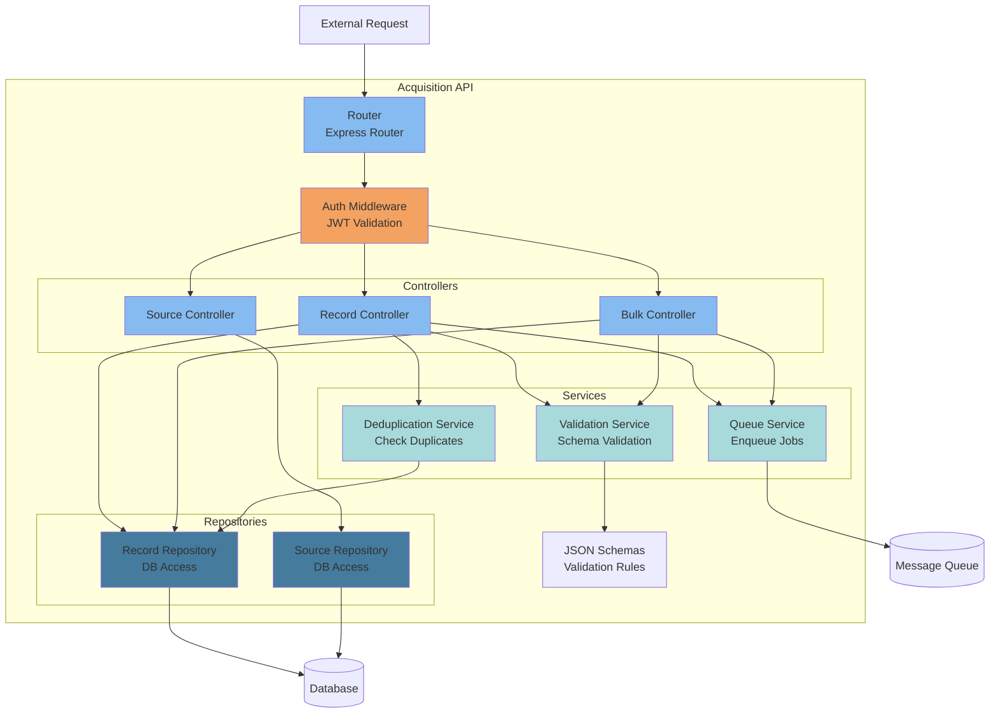
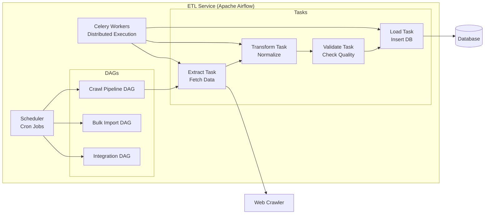
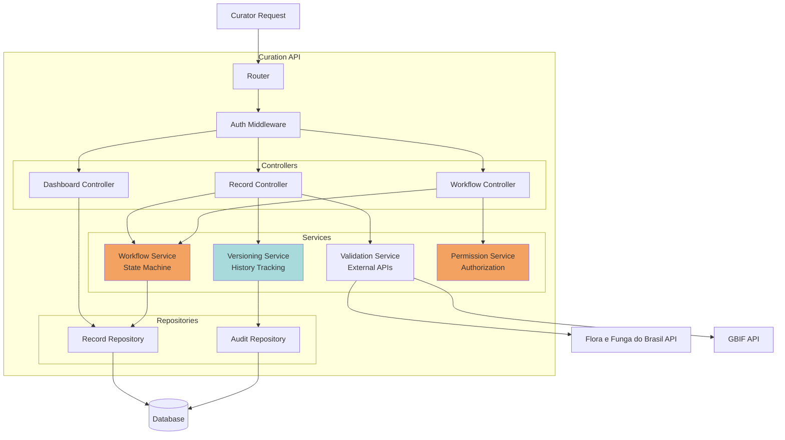
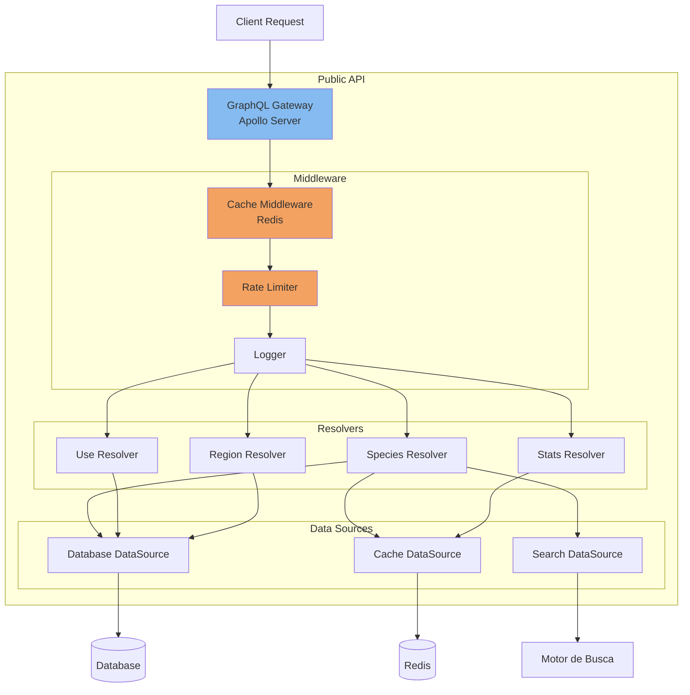
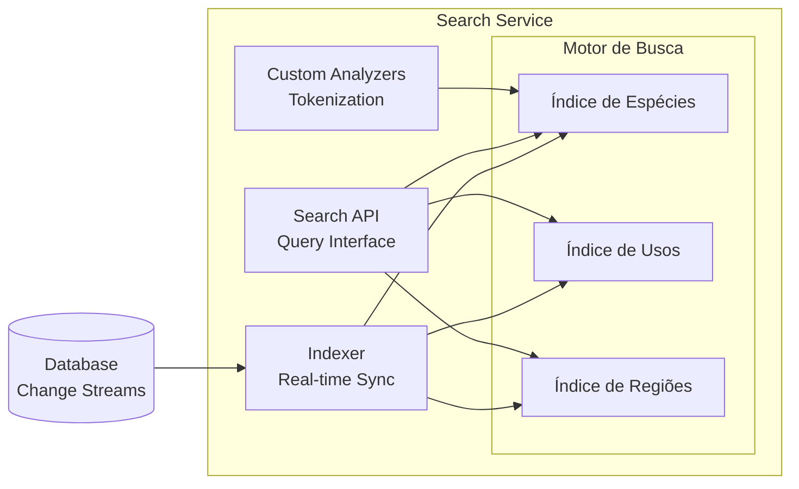

# C4 Model - Level 3: Diagrama de Componentes

## Visão Geral

Este documento detalha os componentes internos de cada container do sistema, organizados pelos três contextos principais: Aquisição, Curadoria e Apresentação.

---

## Contexto 1: Aquisição

### Acquisition API - Componentes Internos



#### Componentes Detalhados

##### 1. Router (Express Router)
**Responsabilidade:** Roteamento de requisições HTTP

**Rotas:**
```javascript
POST   /records              → RecordController.create()
POST   /bulk                 → BulkController.import()
GET    /status/:id           → RecordController.getStatus()
POST   /validate             → RecordController.validate()
GET    /sources              → SourceController.list()
POST   /sources              → SourceController.register()
```

##### 2. Auth Middleware
**Responsabilidade:** Autenticação e autorização

**Funções:**
- Validar JWT token
- Verificar permissões (RBAC)
- Adicionar contexto de usuário na request
- Rate limiting por usuário

```javascript
const authMiddleware = async (req, res, next) => {
  const token = req.headers.authorization?.split(' ')[1];
  if (!token) return res.status(401).json({ error: 'Unauthorized' });

  try {
    const payload = jwt.verify(token, SECRET);
    req.user = await UserRepository.findById(payload.userId);
    next();
  } catch (error) {
    res.status(401).json({ error: 'Invalid token' });
  }
};
```

##### 3. Record Controller
**Responsabilidade:** Orquestrar criação de registros

**Métodos:**
```javascript
class RecordController {
  async create(req, res) {
    // 1. Validar schema
    const validation = await ValidationService.validate(req.body);
    if (!validation.valid) return res.status(400).json(validation.errors);

    // 2. Verificar duplicação
    const isDuplicate = await DeduplicationService.check(req.body);
    if (isDuplicate) return res.status(409).json({ error: 'Duplicate' });

    // 3. Salvar com status 'pending'
    const record = await RecordRepository.create({
      ...req.body,
      status: 'pending',
      createdBy: req.user.id
    });

    // 4. Enfileirar para processamento
    await QueueService.enqueue('acquisition.new', record);

    return res.status(201).json(record);
  }
}
```

##### 4. Validation Service
**Responsabilidade:** Validar estrutura de dados

**JSON Schema Example:**
```json
{
  "$schema": "http://json-schema.org/draft-07/schema#",
  "type": "object",
  "required": ["scientificName", "uses", "source"],
  "properties": {
    "scientificName": {
      "type": "string",
      "minLength": 3
    },
    "commonNames": {
      "type": "array",
      "items": { "type": "string" }
    },
    "uses": {
      "type": "array",
      "items": {
        "type": "object",
        "required": ["description", "category"],
        "properties": {
          "description": { "type": "string" },
          "category": {
            "type": "string",
            "enum": ["medicinal", "food", "ritual", "construction"]
          },
          "preparationMethod": { "type": "string" }
        }
      }
    },
    "location": {
      "type": "object",
      "properties": {
        "latitude": { "type": "number" },
        "longitude": { "type": "number" },
        "region": { "type": "string" }
      }
    },
    "source": {
      "type": "object",
      "required": ["type"],
      "properties": {
        "type": {
          "type": "string",
          "enum": ["primary", "secondary"]
        },
        "reference": { "type": "string" },
        "doi": { "type": "string" }
      }
    }
  }
}
```

##### 5. Deduplication Service
**Responsabilidade:** Detectar registros duplicados

**Algoritmo:**
```javascript
class DeduplicationService {
  async check(record) {
    // Busca exata por nome científico + fonte
    const exactMatch = await RecordRepository.findOne({
      scientificName: record.scientificName,
      'source.doi': record.source.doi
    });
    if (exactMatch) return { isDuplicate: true, matchId: exactMatch.id };

    // Busca fuzzy por similaridade
    const similarRecords = await RecordRepository.search({
      scientificName: { $regex: record.scientificName, $options: 'i' }
    });

    for (const similar of similarRecords) {
      const similarity = this.calculateSimilarity(record, similar);
      if (similarity > 0.85) {
        return {
          isDuplicate: true,
          matchId: similar.id,
          similarity
        };
      }
    }

    return { isDuplicate: false };
  }

  calculateSimilarity(record1, record2) {
    // Levenshtein distance ou algoritmo similar
    // Comparar: scientificName, uses, location
  }
}
```

##### 6. Queue Service
**Responsabilidade:** Enfileirar jobs para processamento assíncrono

```javascript
class QueueService {
  constructor() {
    this.channel = null; // RabbitMQ channel
  }

  async enqueue(queueName, data, options = {}) {
    const message = JSON.stringify({
      data,
      timestamp: new Date(),
      retries: 0
    });

    await this.channel.sendToQueue(queueName, Buffer.from(message), {
      persistent: true,
      ...options
    });
  }
}
```

---

### ETL Service - Componentes Internos



#### DAG: Crawl Pipeline

```python
from airflow import DAG
from airflow.operators.python import PythonOperator
from datetime import datetime, timedelta

default_args = {
    'owner': 'data-team',
    'retries': 3,
    'retry_delay': timedelta(minutes=5)
}

with DAG(
    'crawl_journals',
    default_args=default_args,
    schedule_interval='0 2 * * *',  # Diariamente às 2h
    start_date=datetime(2025, 1, 1),
    catchup=False
) as dag:

    extract_task = PythonOperator(
        task_id='extract_articles',
        python_callable=extract_articles_from_journals
    )

    transform_task = PythonOperator(
        task_id='transform_to_standard_format',
        python_callable=transform_data
    )

    validate_task = PythonOperator(
        task_id='validate_data_quality',
        python_callable=validate_records
    )

    load_task = PythonOperator(
        task_id='load_to_database',
        python_callable=load_records
    )

    extract_task >> transform_task >> validate_task >> load_task
```

---

## Contexto 2: Curadoria

### Curation API - Componentes Internos



#### Componentes Detalhados

##### 1. Workflow Service
**Responsabilidade:** Gerenciar máquina de estados da curadoria

**Estado Transitions:**
```javascript
class WorkflowService {
  constructor() {
    this.states = {
      'pending': ['in_review', 'rejected'],
      'in_review': ['in_validation', 'pending', 'rejected'],
      'in_validation': ['approved', 'in_review'],
      'approved': ['published'],
      'published': [],
      'rejected': []
    };
  }

  async transition(recordId, newState, userId, comments) {
    const record = await RecordRepository.findById(recordId);

    // Validar transição permitida
    if (!this.states[record.status].includes(newState)) {
      throw new Error(`Invalid transition: ${record.status} → ${newState}`);
    }

    // Verificar permissões
    const hasPermission = await PermissionService.canTransition(
      userId,
      record,
      newState
    );
    if (!hasPermission) throw new Error('Unauthorized');

    // Criar versão histórica
    await VersioningService.createVersion(record);

    // Atualizar estado
    record.status = newState;
    record.lastModifiedBy = userId;
    record.lastModifiedAt = new Date();
    await RecordRepository.update(record);

    // Registrar auditoria
    await AuditRepository.log({
      recordId,
      userId,
      action: `transition_${record.status}_to_${newState}`,
      comments,
      timestamp: new Date()
    });

    // Notificar interessados
    await NotificationService.notify({
      type: 'status_changed',
      recordId,
      newStatus: newState
    });

    return record;
  }
}
```

##### 2. Validation Service (External)
**Responsabilidade:** Integrar com APIs externas para validação

```javascript
class ValidationService {
  async validateTaxonomy(scientificName) {
    // Tentar Flora e Funga do Brasil (primária)
    let floraResponse;
    try {
      floraResponse = await axios.get(
        `https://floradobrasil.jbrj.gov.br/api/v1/search`,
        { params: { name: scientificName } }
      );
    } catch (error) {
      console.log('Flora e Funga não encontrou. Tentando GBIF...');
      floraResponse = null;
    }

    // Fallback para GBIF se não encontrado na Flora
    let gbifResponse;
    if (!floraResponse || !floraResponse.data.results.length) {
      gbifResponse = await axios.get(
        `https://api.gbif.org/v1/species/match`,
        { params: { name: scientificName } }
      );
    }

    return {
      flora: floraResponse?.data.results[0] || null,
      gbif: gbifResponse?.data || null,
      source: floraResponse ? 'Flora e Funga do Brasil' : 'GBIF',
      recommendation: this.generateRecommendation(floraResponse, gbifResponse)
    };
  }

  generateRecommendation(flora, gbif) {
    if (flora && flora.data.results.length > 0) {
      return {
        status: 'approved',
        message: 'Nomenclatura validada pela Flora e Funga do Brasil',
        suggestedName: flora.data.results[0].scientificName,
        source: 'Flora e Funga do Brasil'
      };
    } else if (gbif && gbif.data.matchType === 'EXACT' && gbif.data.confidence >= 95) {
      return {
        status: 'approved',
        message: 'Taxonomia validada com alta confiança via GBIF',
        suggestedName: gbif.data.scientificName,
        source: 'GBIF'
      };
    } else if (gbif && gbif.data.matchType === 'FUZZY') {
      return {
        status: 'review',
        message: 'Nome similar encontrado via GBIF. Revisar sugestão.',
        suggestedName: gbif.data.scientificName
      };
    } else {
      return {
        status: 'not_found',
        message: 'Espécie não encontrada na Flora e Funga do Brasil ou GBIF. Verificar nomenclatura.',
        suggestedName: null
      };
    }
  }
}
```

##### 3. Versioning Service
**Responsabilidade:** Rastrear histórico de alterações

```javascript
class VersioningService {
  async createVersion(record) {
    const version = {
      recordId: record.id,
      versionNumber: record.version + 1,
      snapshot: JSON.parse(JSON.stringify(record)), // Deep clone
      createdAt: new Date(),
      createdBy: record.lastModifiedBy
    };

    await AuditRepository.insertVersion(version);

    // Atualizar número de versão no registro
    record.version += 1;
  }

  async getHistory(recordId) {
    return await AuditRepository.findVersions({ recordId })
      .sort({ versionNumber: -1 });
  }

  async revert(recordId, versionNumber, userId) {
    const version = await AuditRepository.findVersion({
      recordId,
      versionNumber
    });

    if (!version) throw new Error('Version not found');

    // Criar nova versão antes de reverter
    const currentRecord = await RecordRepository.findById(recordId);
    await this.createVersion(currentRecord);

    // Restaurar snapshot
    const restoredRecord = version.snapshot;
    restoredRecord.lastModifiedBy = userId;
    restoredRecord.lastModifiedAt = new Date();

    await RecordRepository.update(restoredRecord);

    return restoredRecord;
  }
}
```

##### 4. Permission Service
**Responsabilidade:** Controle de acesso granular

**RBAC Matrix:**
| Role | Create | Read | Update | Approve | Publish | Delete |
|------|--------|------|--------|---------|---------|--------|
| Researcher | ✓ | ✓ | Own | ✗ | ✗ | Own |
| Curator | ✓ | ✓ | ✓ | ✓ | ✗ | ✗ |
| Admin | ✓ | ✓ | ✓ | ✓ | ✓ | ✓ |
| Community Rep | ✓ | ✓ | Own | Own | Own | ✗ |

```javascript
class PermissionService {
  async canTransition(userId, record, newState) {
    const user = await UserRepository.findById(userId);

    // Regras por estado de destino
    const rules = {
      'in_review': ['researcher', 'curator', 'admin'],
      'in_validation': ['curator', 'admin'],
      'approved': ['curator', 'admin'],
      'published': ['admin'],
      'rejected': ['curator', 'admin']
    };

    // Verificar papel do usuário
    if (!rules[newState].includes(user.role)) return false;

    // Representante de comunidade pode controlar próprios dados
    if (user.role === 'community_rep') {
      return record.community === user.community;
    }

    return true;
  }

  async canEdit(userId, recordId) {
    const user = await UserRepository.findById(userId);
    const record = await RecordRepository.findById(recordId);

    if (user.role === 'admin' || user.role === 'curator') return true;
    if (user.role === 'researcher' && record.createdBy === userId) return true;
    if (user.role === 'community_rep' && record.community === user.community) return true;

    return false;
  }
}
```

---

## Contexto 3: Apresentação

### Public API - Componentes Internos



#### GraphQL Schema

```graphql
type Query {
  # Espécies
  species(id: ID!): Species
  searchSpecies(
    name: String
    family: String
    region: String
    use: String
    limit: Int = 20
    offset: Int = 0
  ): SpeciesConnection!

  # Usos Tradicionais
  uses(category: UseCategory, limit: Int = 20): [TraditionalUse!]!
  useCategories: [UseCategory!]!

  # Regiões
  regions: [Region!]!
  regionStats(regionId: ID!): RegionStats!

  # Estatísticas
  stats: GlobalStats!
}

type Species {
  id: ID!
  scientificName: String!
  commonNames: [String!]!
  family: String
  kingdom: String
  images: [Image!]!
  uses: [TraditionalUse!]!
  regions: [Region!]!
  verified: Boolean!
  lastUpdated: DateTime!
}

type TraditionalUse {
  id: ID!
  description: String!
  category: UseCategory!
  preparationMethod: String
  community: String
  source: Source!
  verified: Boolean!
}

enum UseCategory {
  MEDICINAL
  FOOD
  RITUAL
  CONSTRUCTION
  CRAFT
  OTHER
}

type Source {
  type: SourceType!
  reference: String
  doi: String
  year: Int
}

enum SourceType {
  PRIMARY
  SECONDARY
}

type Region {
  id: ID!
  name: String!
  country: String!
  coordinates: Coordinates
  speciesCount: Int!
}

type Coordinates {
  latitude: Float!
  longitude: Float!
}

type SpeciesConnection {
  edges: [SpeciesEdge!]!
  pageInfo: PageInfo!
  totalCount: Int!
}

type SpeciesEdge {
  node: Species!
  cursor: String!
}

type PageInfo {
  hasNextPage: Boolean!
  hasPreviousPage: Boolean!
  startCursor: String
  endCursor: String
}

type GlobalStats {
  totalSpecies: Int!
  totalUses: Int!
  totalCommunities: Int!
  verifiedRecords: Int!
  lastUpdate: DateTime!
}
```

#### Resolvers Implementation

```javascript
// Species Resolver
const speciesResolver = {
  Query: {
    species: async (_, { id }, { dataSources }) => {
      // Tentar cache primeiro
      const cached = await dataSources.cache.get(`species:${id}`);
      if (cached) return JSON.parse(cached);

      // Buscar no banco
      const species = await dataSources.db.findSpeciesById(id);

      // Cachear resultado
      await dataSources.cache.set(
        `species:${id}`,
        JSON.stringify(species),
        { EX: 3600 } // 1 hora
      );

      return species;
    },

    searchSpecies: async (_, args, { dataSources }) => {
      const { name, family, region, use, limit, offset } = args;

      // Usar motor de busca para busca avançada
      const results = await dataSources.search.searchSpecies({
        query: {
          bool: {
            must: [
              name && { multi_match: { query: name, fields: ['scientificName', 'commonNames'] } },
              family && { term: { family: family } },
              region && { term: { 'regions.id': region } },
              use && { nested: { path: 'uses', query: { match: { 'uses.category': use } } } }
            ].filter(Boolean)
          }
        },
        from: offset,
        size: limit
      });

      return {
        edges: results.hits.map(hit => ({
          node: hit._source,
          cursor: Buffer.from(hit._id).toString('base64')
        })),
        pageInfo: {
          hasNextPage: results.total.value > offset + limit,
          hasPreviousPage: offset > 0,
          startCursor: results.hits[0] ? Buffer.from(results.hits[0]._id).toString('base64') : null,
          endCursor: results.hits[results.hits.length - 1] ? Buffer.from(results.hits[results.hits.length - 1]._id).toString('base64') : null
        },
        totalCount: results.total.value
      };
    }
  },

  Species: {
    uses: async (parent, _, { dataSources }) => {
      return await dataSources.db.findUsesBySpeciesId(parent.id);
    },

    regions: async (parent, _, { dataSources }) => {
      return await dataSources.db.findRegionsBySpeciesId(parent.id);
    },

    images: async (parent, _, { dataSources }) => {
      return parent.images.map(img => ({
        url: `${process.env.CDN_URL}/images/species/${parent.id}/${img.filename}`,
        caption: img.caption,
        credit: img.credit
      }));
    }
  }
};
```

#### Cache Middleware

```javascript
class CacheMiddleware {
  constructor(redis) {
    this.redis = redis;
  }

  async cacheQuery(query, ttl = 3600) {
    return async (resolve, parent, args, context, info) => {
      const key = this.generateCacheKey(info.fieldName, args);

      // Verificar cache
      const cached = await this.redis.get(key);
      if (cached) {
        console.log(`Cache HIT: ${key}`);
        return JSON.parse(cached);
      }

      // Executar resolver
      const result = await resolve(parent, args, context, info);

      // Cachear resultado
      await this.redis.set(key, JSON.stringify(result), { EX: ttl });
      console.log(`Cache MISS: ${key}`);

      return result;
    };
  }

  generateCacheKey(fieldName, args) {
    const argsHash = crypto
      .createHash('md5')
      .update(JSON.stringify(args))
      .digest('hex');
    return `gql:${fieldName}:${argsHash}`;
  }

  async invalidate(pattern) {
    const keys = await this.redis.keys(pattern);
    if (keys.length > 0) {
      await this.redis.del(...keys);
    }
  }
}
```

#### Rate Limiter

```javascript
class RateLimiter {
  constructor(redis) {
    this.redis = redis;
  }

  async checkLimit(apiKey, limit = 100, window = 60) {
    const key = `rate:${apiKey}`;
    const current = await this.redis.incr(key);

    if (current === 1) {
      await this.redis.expire(key, window);
    }

    if (current > limit) {
      throw new Error(`Rate limit exceeded. Max ${limit} requests per ${window}s`);
    }

    return {
      remaining: limit - current,
      reset: await this.redis.ttl(key)
    };
  }
}
```

---

### Search Service - Componentes Internos



#### Mapeamento de Índices do Motor de Busca

```json
{
  "species": {
    "mappings": {
      "properties": {
        "scientificName": {
          "type": "text",
          "analyzer": "scientific_name_analyzer",
          "fields": {
            "keyword": { "type": "keyword" }
          }
        },
        "commonNames": {
          "type": "text",
          "analyzer": "standard"
        },
        "family": { "type": "keyword" },
        "kingdom": { "type": "keyword" },
        "uses": {
          "type": "nested",
          "properties": {
            "description": { "type": "text" },
            "category": { "type": "keyword" }
          }
        },
        "regions": {
          "type": "nested",
          "properties": {
            "id": { "type": "keyword" },
            "name": { "type": "text" },
            "country": { "type": "keyword" }
          }
        },
        "verified": { "type": "boolean" },
        "lastUpdated": { "type": "date" }
      }
    },
    "settings": {
      "analysis": {
        "analyzer": {
          "scientific_name_analyzer": {
            "type": "custom",
            "tokenizer": "standard",
            "filter": ["lowercase", "asciifolding"]
          }
        }
      }
    }
  }
}
```

#### Real-time Indexing

```javascript
// Change Streams para sincronização em tempo real com o motor de busca
const changeStream = db.collection('records').watch();

changeStream.on('change', async (change) => {
  switch (change.operationType) {
    case 'insert':
      await searchClient.index({
        index: 'species',
        id: change.fullDocument._id,
        document: transformToSearchDocument(change.fullDocument)
      });
      break;

    case 'update':
      await searchClient.update({
        index: 'species',
        id: change.documentKey._id,
        doc: transformToSearchDocument(change.updateDescription.updatedFields)
      });
      break;

    case 'delete':
      await searchClient.delete({
        index: 'species',
        id: change.documentKey._id
      });
      break;
  }
});
```

---

## Padrões de Comunicação

### 1. Request-Response (Síncrono)
- Frontend → API Gateway → Backend APIs
- APIs → Database/Cache

### 2. Event-Driven (Assíncrono)
- Database Change Streams → Search Indexer
- Workflow Transitions → Notification Service

### 3. Queue-Based (Assíncrono)
- Acquisition API → Queue → ETL Service
- Crawler → Queue → Validation Service

---

## Qualidade de Código

### Testing Strategy

**Unit Tests:**
- Componentes isolados (Services, Repositories)
- Cobertura mínima: 80%
- Framework: Jest (JavaScript), Pytest (Python)

**Integration Tests:**
- APIs endpoints
- Database interactions
- External API mocking

**E2E Tests:**
- Fluxos críticos (Cypress/Playwright)
- Workflow de curadoria completo
- Busca e exportação pública

### Code Quality Tools

- **Linting:** ESLint, Pylint
- **Formatting:** Prettier, Black
- **Type Checking:** TypeScript, Python Type Hints
- **Security:** SonarQube, Snyk

---

## Próximos Passos

- [Architecture Decision Records](../architecture-decisions/) - Documentação de decisões técnicas
- [Data Model](../architecture-decisions/ADR-003-data-model.md) - Estrutura detalhada dos dados
