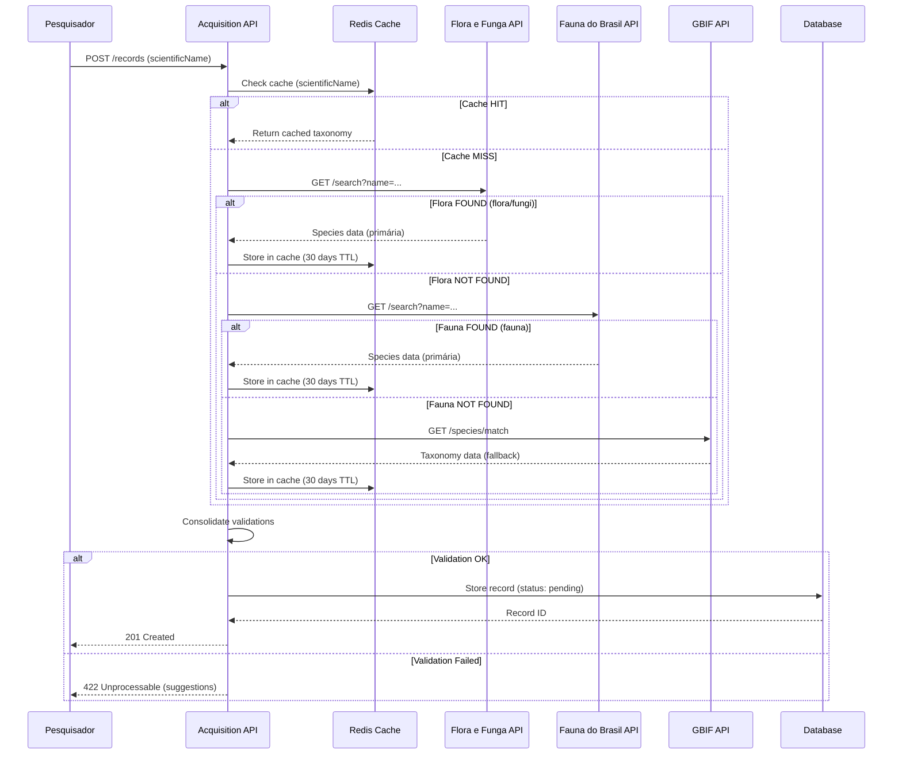

# Padrões de Integração e APIs Externas

## Visão Geral

Este documento detalha os padrões de integração com sistemas externos e as estratégias para consumo e fornecimento de dados através de APIs.

## Integrações Externas

### 1. GBIF (Global Biodiversity Information Facility)

**URL Base:** `https://api.gbif.org/v1/`

**Propósito:** Validação e enriquecimento de dados taxonômicos

#### Endpoints Utilizados

##### 1.1 Species Match

Valida nome científico e obtém classificação taxonômica completa.

**Request:**
```http
GET https://api.gbif.org/v1/species/match?name=Manihot esculenta
```

**Response:**
```json
{
  "usageKey": 5290063,
  "scientificName": "Manihot esculenta Crantz",
  "canonicalName": "Manihot esculenta",
  "rank": "SPECIES",
  "status": "ACCEPTED",
  "confidence": 97,
  "matchType": "EXACT",
  "kingdom": "Plantae",
  "phylum": "Tracheophyta",
  "order": "Malpighiales",
  "family": "Euphorbiaceae",
  "genus": "Manihot",
  "species": "Manihot esculenta",
  "kingdomKey": 6,
  "phylumKey": 7707728,
  "classKey": 220,
  "orderKey": 1355,
  "familyKey": 4691,
  "genusKey": 3065809,
  "speciesKey": 5290063
}
```

**Uso no Sistema:**
```javascript
async function validateTaxonomy(scientificName) {
  const response = await fetch(
    `https://api.gbif.org/v1/species/match?name=${encodeURIComponent(scientificName)}`
  );
  const data = await response.json();

  if (data.matchType === 'EXACT' && data.confidence >= 90) {
    return {
      validated: true,
      acceptedName: data.scientificName,
      taxonomy: {
        kingdom: data.kingdom,
        phylum: data.phylum,
        class: data.class,
        order: data.order,
        family: data.family,
        genus: data.genus
      },
      taxonKey: data.usageKey
    };
  } else if (data.matchType === 'FUZZY') {
    return {
      validated: false,
      suggestion: data.scientificName,
      confidence: data.confidence,
      message: 'Nome similar encontrado. Revisar sugestão.'
    };
  } else {
    return {
      validated: false,
      message: 'Espécie não encontrada no GBIF'
    };
  }
}
```

##### 1.2 Species Details

Obtém informações detalhadas sobre uma espécie.

**Request:**
```http
GET https://api.gbif.org/v1/species/5290063
```

**Dados Relevantes:**
- Nomes vernaculares (common names)
- Sinônimos
- Distribuição geográfica
- Status de conservação (quando disponível)

##### 1.3 Name Usage Search

Busca espécies por nome parcial (autocomplete).

**Request:**
```http
GET https://api.gbif.org/v1/species/search?q=Manihot&rank=SPECIES&limit=10
```

**Uso:** Implementar autocomplete na interface de entrada de dados.

#### Estratégias de Cache

```javascript
// Cache de validações por 30 dias (taxonomia não muda com frequência)
const CACHE_TTL = 30 * 24 * 60 * 60; // 30 dias em segundos

async function getCachedTaxonomy(scientificName) {
  const cacheKey = `gbif:match:${scientificName.toLowerCase()}`;

  // Tentar cache primeiro
  const cached = await redis.get(cacheKey);
  if (cached) return JSON.parse(cached);

  // Buscar na API
  const result = await validateTaxonomy(scientificName);

  // Cachear resultado
  await redis.set(cacheKey, JSON.stringify(result), { EX: CACHE_TTL });

  return result;
}
```

#### Rate Limiting

**Limite:** Sem limite oficial, mas recomenda-se máximo 10 req/s

**Implementação:**
```javascript
const Bottleneck = require('bottleneck');

const gbifLimiter = new Bottleneck({
  maxConcurrent: 5,
  minTime: 200 // 200ms entre requisições (5 req/s)
});

const gbifRequest = gbifLimiter.wrap(async (url) => {
  return await fetch(url);
});
```

---

### 2. Flora e Funga do Brasil

**URL Base:** `https://floradobrasil.jbrj.gov.br/api/v1/`

**Propósito:** Verificação primária de nomenclatura científica para plantas, algas e fungos brasileiros

#### Endpoint Principal

##### 2.1 Search Species

Busca espécies por nome científico com validação contra a base oficial brasileira.

**Request:**
```http
GET https://floradobrasil.jbrj.gov.br/api/v1/search?name=Manihot esculenta
```

**Response:**
```json
{
  "results": [
    {
      "id": "12345",
      "scientificName": "Manihot esculenta Crantz",
      "synonyms": [
        "Manihot utilissima Pohl",
        "Janipha manihot H.Karst."
      ],
      "family": "Euphorbiaceae",
      "genus": "Manihot",
      "species": "esculenta",
      "author": "Crantz",
      "distribution": ["AC", "AM", "AP", "BA", "CE", "ES"],
      "conservationStatus": "LC",
      "endemism": false,
      "originType": "cultivated"
    }
  ]
}
```

**Uso no Sistema:**
```javascript
async function validateFloraDoBasil(scientificName) {
  try {
    const response = await fetch(
      `https://floradobrasil.jbrj.gov.br/api/v1/search?name=${encodeURIComponent(scientificName)}`
    );
    const data = await response.json();

    if (data.results && data.results.length > 0) {
      const species = data.results[0];
      return {
        found: true,
        scientificName: species.scientificName,
        family: species.family,
        synonyms: species.synonyms || [],
        distribution: species.distribution,
        conservationStatus: species.conservationStatus,
        source: 'Flora e Funga do Brasil'
      };
    } else {
      return {
        found: false,
        message: 'Espécie não encontrada na Flora e Funga do Brasil',
        source: 'Flora e Funga do Brasil'
      };
    }
  } catch (error) {
    console.error('Flora e Funga error:', error);
    return null;
  }
}
```

#### Estratégia de Validação em Cascata

```javascript
async function validateTaxonomyWithFallback(scientificName) {
  // 1. Tentar Flora e Funga do Brasil
  const floraResult = await validateFloraDoBasil(scientificName);
  if (floraResult && floraResult.found) {
    return floraResult;
  }

  // 2. Fallback para GBIF
  console.log('Não encontrado na Flora e Funga. Tentando GBIF...');
  const gbifResult = await validateTaxonomy(scientificName);

  if (gbifResult.validated) {
    return {
      ...gbifResult,
      source: 'GBIF (fallback)'
    };
  }

  // 3. Falha total
  return {
    found: false,
    message: 'Espécie não encontrada em nenhuma base de dados',
    suggestedAction: 'Verificar nomenclatura ou contatar especialista'
  };
}
```

#### Casos de Uso

1. **Validação Primária**: Verificação rápida de espécies brasileiras
2. **Distribuição Geográfica**: Obter estados/regiões onde a espécie ocorre
3. **Status de Conservação**: Integração com classificação oficial brasileira
4. **Detecção de Sinônimos**: Identificar nomes alternativos aceitos

---

### 3. Fauna do Brasil

**URL Base:** `https://fauna.jbrj.gov.br/api/v1/`

**Propósito:** Verificação primária de nomenclatura científica para fauna brasileira

#### Endpoint Principal

##### 3.1 Search Species

Busca espécies de fauna por nome científico com validação contra o catálogo oficial brasileiro.

**Request:**
```http
GET https://fauna.jbrj.gov.br/api/v1/search?name=Panthera onca
```

**Response:**
```json
{
  "results": [
    {
      "id": "54321",
      "scientificName": "Panthera onca Linnaeus, 1758",
      "commonName": "Jaguar",
      "commonNamePT": "Onça-pintada",
      "family": "Felidae",
      "order": "Carnivora",
      "class": "Mammalia",
      "phylum": "Chordata",
      "kingdom": "Animalia",
      "author": "Linnaeus",
      "year": 1758,
      "synonyms": [
        "Felis onca",
        "Jaguar onca"
      ],
      "distribution": ["AC", "AM", "AP", "BA", "MA", "MT", "MS", "MG", "PA", "PR", "RO", "RR", "SP", "TO"],
      "conservationStatus": "Vulnerable",
      "endemism": false,
      "taxonomy": {
        "kingdom": "Animalia",
        "phylum": "Chordata",
        "class": "Mammalia",
        "order": "Carnivora",
        "family": "Felidae",
        "genus": "Panthera",
        "species": "onca"
      }
    }
  ]
}
```

**Uso no Sistema:**
```javascript
async function validateFaunaDoBasil(scientificName) {
  try {
    const response = await fetch(
      `https://fauna.jbrj.gov.br/api/v1/search?name=${encodeURIComponent(scientificName)}`
    );
    const data = await response.json();

    if (data.results && data.results.length > 0) {
      const species = data.results[0];
      return {
        found: true,
        scientificName: species.scientificName,
        commonName: species.commonNamePT || species.commonName,
        family: species.family,
        synonyms: species.synonyms || [],
        distribution: species.distribution,
        conservationStatus: species.conservationStatus,
        taxonomy: species.taxonomy,
        source: 'Fauna do Brasil'
      };
    } else {
      return {
        found: false,
        message: 'Espécie não encontrada na Fauna do Brasil',
        source: 'Fauna do Brasil'
      };
    }
  } catch (error) {
    console.error('Fauna do Brasil error:', error);
    return null;
  }
}
```

#### Casos de Uso

1. **Validação Primária**: Verificação rápida de fauna brasileira
2. **Distribuição Geográfica**: Obter estados onde a espécie ocorre
3. **Status de Conservação**: Integração com classificação oficial brasileira IUCN
4. **Detecção de Sinônimos**: Identificar nomes alternativos aceitos
5. **Nomes Vernaculares**: Obter nomes comuns em português

---

### 4. Periódicos Científicos

#### 4.1 PubMed Central (PMC)

**URL Base:** `https://eutils.ncbi.nlm.nih.gov/entrez/eutils/`

**Propósito:** Buscar artigos científicos sobre etnobotânica

##### Search Articles

**Request:**
```http
GET https://eutils.ncbi.nlm.nih.gov/entrez/eutils/esearch.fcgi?db=pmc&term=ethnobotany+AND+medicinal+plants&retmax=20&retmode=json
```

**Response:**
```json
{
  "esearchresult": {
    "count": "1234",
    "idlist": ["PMC8675432", "PMC8634521", "..."]
  }
}
```

##### Fetch Article Details

**Request:**
```http
GET https://eutils.ncbi.nlm.nih.gov/entrez/eutils/efetch.fcgi?db=pmc&id=PMC8675432&retmode=xml
```

**Parsing:**
- Título, autores, resumo
- Data de publicação
- DOI
- Palavras-chave
- Menções de espécies (via NLP)

**Crawler Implementation:**
```python
import requests
from bs4 import BeautifulSoup
import time

class PubMedCrawler:
    BASE_URL = "https://eutils.ncbi.nlm.nih.gov/entrez/eutils/"

    def __init__(self, email):
        self.email = email  # NCBI requer email
        self.delay = 0.34  # Max 3 req/s

    def search_articles(self, query, max_results=100):
        """Busca artigos por query"""
        params = {
            'db': 'pmc',
            'term': query,
            'retmax': max_results,
            'retmode': 'json',
            'email': self.email
        }

        response = requests.get(f"{self.BASE_URL}esearch.fcgi", params=params)
        data = response.json()

        return data['esearchresult']['idlist']

    def fetch_article_metadata(self, pmc_id):
        """Obtém metadados de um artigo"""
        params = {
            'db': 'pmc',
            'id': pmc_id,
            'retmode': 'xml',
            'email': self.email
        }

        time.sleep(self.delay)

        response = requests.get(f"{self.BASE_URL}efetch.fcgi", params=params)
        soup = BeautifulSoup(response.content, 'xml')

        # Parse XML
        article = {
            'pmc_id': pmc_id,
            'title': soup.find('article-title').get_text() if soup.find('article-title') else None,
            'abstract': soup.find('abstract').get_text() if soup.find('abstract') else None,
            'authors': [author.get_text() for author in soup.find_all('contrib', {'contrib-type': 'author'})],
            'doi': soup.find('article-id', {'pub-id-type': 'doi'}).get_text() if soup.find('article-id', {'pub-id-type': 'doi'}) else None,
            'publication_date': self._parse_date(soup),
            'keywords': [kw.get_text() for kw in soup.find_all('kwd')]
        }

        return article

    def _parse_date(self, soup):
        """Parse data de publicação"""
        pub_date = soup.find('pub-date')
        if pub_date:
            year = pub_date.find('year').get_text() if pub_date.find('year') else None
            month = pub_date.find('month').get_text() if pub_date.find('month') else '01'
            day = pub_date.find('day').get_text() if pub_date.find('day') else '01'
            return f"{year}-{month.zfill(2)}-{day.zfill(2)}"
        return None

# Uso
crawler = PubMedCrawler(email='system@etnoknowledge.org')
article_ids = crawler.search_articles('ethnobotany AND traditional knowledge', max_results=50)

for article_id in article_ids:
    metadata = crawler.fetch_article_metadata(article_id)
    # Enfileirar para processamento
    queue.enqueue('acquisition.new', metadata)
```

#### 4.2 Crossref API

**URL Base:** `https://api.crossref.org/`

**Propósito:** Obter metadados de publicações via DOI

##### Resolve DOI

**Request:**
```http
GET https://api.crossref.org/works/10.1234/example.doi
```

**Response:**
```json
{
  "message": {
    "DOI": "10.1234/example.doi",
    "title": ["Traditional knowledge of medicinal plants..."],
    "author": [
      {"given": "João", "family": "Silva"},
      {"given": "Maria", "family": "Santos"}
    ],
    "published": {"date-parts": [[2023, 5, 15]]},
    "container-title": ["Journal of Ethnobiology"],
    "publisher": "Society of Ethnobiology",
    "abstract": "<jats:p>Abstract text...</jats:p>"
  }
}
```

**Uso:**
```javascript
async function resolveDOI(doi) {
  const response = await fetch(`https://api.crossref.org/works/${doi}`);
  const data = await response.json();

  return {
    doi: data.message.DOI,
    title: data.message.title[0],
    authors: data.message.author.map(a => `${a.given} ${a.family}`),
    year: data.message.published['date-parts'][0][0],
    journal: data.message['container-title'][0],
    publisher: data.message.publisher
  };
}
```

---

### 5. Plataforma de Territórios Tradicionais (MPF)

**URL Base:** `https://territoriostradicionais.mpf.mp.br/api/v1/`

**Propósito:** Consultar dados territoriais e validar proveniência geográfica do conhecimento tradicional

#### Endpoints Utilizados

##### 5.1 Search Territories

Busca territórios por região, povo indígena ou coordenadas geográficas.

**Request:**
```http
GET https://territoriostradicionais.mpf.mp.br/api/v1/territories?region=AM&type=indigenous
```

**Response:**
```json
{
  "territories": [
    {
      "id": "IND_001",
      "name": "Terra Indígena Yanomami",
      "people": ["Yanomami"],
      "state": "AM",
      "demarcation_status": "demarcated",
      "demarcation_date": "1992-05-28",
      "area_hectares": 9664975,
      "geometry": {
        "type": "Polygon",
        "coordinates": [...]
      },
      "official_url": "https://pib.socioambiental.org/territories/..."
    }
  ]
}
```

##### 5.2 Territory Details

Obtém informações detalhadas sobre um território específico.

**Request:**
```http
GET https://territoriostradicionais.mpf.mp.br/api/v1/territories/IND_001
```

**Dados Relevantes:**
- Polígonos e coordenadas geográficas
- Povos indígenas residentes
- Status de demarcação
- Conflitos registrados
- Dados populacionais

##### 5.3 Point-in-Polygon Query

Verifica se um ponto geográfico pertence a algum território.

**Request:**
```http
GET https://territoriostradicionais.mpf.mp.br/api/v1/territories/point-in-polygon?lat=-3.5&lon=-65.5
```

**Response:**
```json
{
  "found": true,
  "territory": {
    "id": "IND_001",
    "name": "Terra Indígena Yanomami",
    "people": ["Yanomami"]
  }
}
```

**Uso no Sistema:**
```javascript
async function validateTerritorialProvenance(coordinates) {
  try {
    const response = await fetch(
      `https://territoriostradicionais.mpf.mp.br/api/v1/territories/point-in-polygon?lat=${coordinates.lat}&lon=${coordinates.lon}`
    );
    const data = await response.json();

    if (data.found) {
      return {
        validated: true,
        territoryId: data.territory.id,
        territoryName: data.territory.name,
        people: data.territory.people,
        source: 'Plataforma de Territórios Tradicionais'
      };
    } else {
      return {
        validated: false,
        message: 'Coordenadas fora de territórios conhecidos',
        source: 'Plataforma de Territórios Tradicionais'
      };
    }
  } catch (error) {
    console.error('Territory validation error:', error);
    return null;
  }
}
```

#### Estratégia de Validação Territorial

```javascript
async function validateTerritoryWithCascade(coordinates, communityName) {
  // 1. Tentar validação por coordenadas (mais precisa)
  const coordinateMatch = await validateTerritorialProvenance(coordinates);
  if (coordinateMatch && coordinateMatch.validated) {
    return coordinateMatch;
  }

  // 2. Fallback: buscar território por nome da comunidade
  const territoryMatch = await searchTerritoryByPeople(communityName);
  if (territoryMatch && territoryMatch.found) {
    return {
      ...territoryMatch,
      warning: 'Matched by community name, not coordinates'
    };
  }

  // 3. Falha - Pode ser fora de territórios ou necessita revisão
  return {
    found: false,
    message: 'Territorio não identificado',
    suggestedAction: 'Verificar coordenadas ou contatar especialista em territórios'
  };
}
```

#### Cache e Performance

```javascript
// Cache de territórios por 7 dias (dados mudam raramente)
const TERRITORY_CACHE_TTL = 7 * 24 * 60 * 60; // 7 dias em segundos

async function getCachedTerritory(territoryId) {
  const cacheKey = `territory:${territoryId}`;

  const cached = await redis.get(cacheKey);
  if (cached) return JSON.parse(cached);

  const result = await fetchTerritoryDetails(territoryId);
  await redis.set(cacheKey, JSON.stringify(result), { EX: TERRITORY_CACHE_TTL });

  return result;
}
```

---

### 6. Outras Fontes Autoritativas

**Propósito:** Validação complementar contra bases de dados especializadas e registros públicos

#### Padrão Genérico para Novas Integrações

Como o sistema precisa ser extensível para incorporar novas fontes autoritativas, define-se um padrão genérico:

```javascript
interface AuthorityDataSource {
  async validate(data) => ValidationResult;
  async enrich(entity) => EnrichedEntity;
  async search(query) => SearchResults[];
}

class ConfigurableAuthoritySource implements AuthorityDataSource {
  constructor(config) {
    this.baseURL = config.baseURL;
    this.apiKey = config.apiKey;
    this.timeout = config.timeout || 5000;
    this.endpoints = config.endpoints;
  }

  async validate(data) {
    const response = await fetch(
      `${this.baseURL}${this.endpoints.validate}`,
      {
        method: 'POST',
        headers: { 'Authorization': `Bearer ${this.apiKey}` },
        body: JSON.stringify(data),
        timeout: this.timeout
      }
    );
    return response.json();
  }

  async enrich(entity) {
    // Implementação específica da fonte
  }

  async search(query) {
    // Implementação específica da fonte
  }
}
```

#### Exemplos de Fontes Autoritativas

**1. SISGEN (Sistema Nacional de Gestão do Patrimônio Genético)**
```javascript
const sisgenSource = new ConfigurableAuthoritySource({
  baseURL: 'https://sisgen.ibict.br/api/v1',
  apiKey: process.env.SISGEN_API_KEY,
  endpoints: {
    validate: '/validate-registration',
    search: '/registrations/search'
  }
});

// Uso
const sisgenValidation = await sisgenSource.validate({
  scientificName: 'Manihot esculenta',
  region: 'Amazonas'
});
```

**2. SiBBr (Sistema de Informação sobre Biodiversidade Brasileira)**
```javascript
const sibbr Source = new ConfigurableAuthoritySource({
  baseURL: 'https://sibbr.jbrj.gov.br/api/v1',
  endpoints: {
    validate: '/species/validate',
    search: '/species/search'
  }
});
```

**3. Registros Comunitários (Futuros)**
```javascript
const communitySource = new ConfigurableAuthoritySource({
  baseURL: 'https://communityregistry.etnoknowledge.org/api/v1',
  endpoints: {
    validate: '/knowledge/validate',
    search: '/knowledge/search'
  }
});
```

#### Estratégia de Priorização

```javascript
class AuthorityValidationChain {
  constructor(sources) {
    this.sources = sources; // Ordenadas por prioridade
  }

  async validateWithPriority(data) {
    const results = [];
    const errors = [];

    for (const source of this.sources) {
      try {
        const result = await source.validate(data);
        results.push({
          source: source.name,
          ...result,
          success: true
        });

        // Se validação bem-sucedida, pode parar ou continuar
        if (result.valid) {
          break; // Primeira válida é suficiente
        }
      } catch (error) {
        errors.push({
          source: source.name,
          error: error.message
        });
      }
    }

    return {
      validations: results,
      errors,
      primaryValidation: results[0] || null,
      allValid: results.some(r => r.valid)
    };
  }
}

// Uso
const chain = new AuthorityValidationChain([
  sibbr,        // Prioridade 1
  sisgen,       // Prioridade 2
  gbif          // Prioridade 3 (fallback)
]);

const validation = await chain.validateWithPriority({
  scientificName: 'Manihot esculenta'
});
```

#### Configuração de Fontes (config.yaml)

```yaml
authorityValidation:
  sources:
    - name: SISGEN
      baseURL: https://sisgen.ibict.br/api/v1
      enabled: true
      priority: 1
      timeout: 5000
      rateLimit: 10_req_per_sec
      endpoints:
        validate: /validate-registration
        search: /registrations/search

    - name: SiBBr
      baseURL: https://sibbr.jbrj.gov.br/api/v1
      enabled: true
      priority: 2
      timeout: 5000
      rateLimit: 20_req_per_sec
      endpoints:
        validate: /species/validate
        search: /species/search

    - name: CommunityRegistry
      baseURL: https://communityregistry.etnoknowledge.org/api/v1
      enabled: false
      priority: 3
      timeout: 5000
      endpoints:
        validate: /knowledge/validate
        search: /knowledge/search

  # Estratégia global
  strategy: 'first_valid'  # ou 'all', 'quorum'
  requireSuccessRate: 0.5  # Ao menos 50% deve ter sucesso
  cacheResults: true
  cacheTTL: 604800  # 7 dias
```

---

### 7. Outras Bases de Dados Regionais (Futuro)

#### 7.1 Integrações Previstas

- **Tropicos (Missouri Botanical Garden)**: Nomenclatura botânica com enfoque em Neotrópicos
- **The Plant List**: Lista de espécies aceitas (fallback adicional)
- **SIBBR (SiBBr)**: Sistema de Informação sobre Biodiversidade Brasileira
- **SISGEN**: Sistema Nacional de Gestão do Patrimônio Genético

#### 7.2 Padrão de Integração

```javascript
// Interface genérica para integrações
class ExternalDataSource {
  async validate(scientificName) {
    throw new Error('Must implement validate()');
  }

  async enrich(species) {
    throw new Error('Must implement enrich()');
  }
}

// Implementação específica para Flora e Funga do Brasil
class FloraDoBasilDataSource extends ExternalDataSource {
  async validate(scientificName) {
    // Lógica específica da Flora do Brasil
    // Retorna resultado se encontrado
  }

  async enrich(species) {
    // Enriquecer com dados adicionais de distribuição
  }
}

// Implementação específica para GBIF (fallback)
class GBIFDataSource extends ExternalDataSource {
  async validate(scientificName) {
    // Lógica do GBIF como fallback
  }

  async enrich(species) {
    // Enriquecer com dados globais
  }
}

// Estratégia de validação: Flora e Funga primeiro, depois GBIF
async function validateWithPriorityStrategy(scientificName) {
  const floraSource = new FloraDoBasilDataSource();
  const gbifSource = new GBIFDataSource();

  // 1. Tentar Flora e Funga do Brasil
  const floraResult = await floraSource.validate(scientificName);
  if (floraResult && floraResult.found) {
    return floraResult;
  }

  // 2. Fallback para GBIF
  const gbifResult = await gbifSource.validate(scientificName);
  if (gbifResult && gbifResult.found) {
    return { ...gbifResult, source: 'GBIF (fallback)' };
  }

  // 3. Falha total
  return { found: false, message: 'Espécie não encontrada' };
}
```

---

## Padrões de Integração

### 1. Retry com Backoff Exponencial

Para lidar com falhas temporárias:

```javascript
async function retryWithBackoff(fn, maxRetries = 3, baseDelay = 1000) {
  for (let attempt = 0; attempt < maxRetries; attempt++) {
    try {
      return await fn();
    } catch (error) {
      if (attempt === maxRetries - 1) throw error;

      const delay = baseDelay * Math.pow(2, attempt);
      console.log(`Attempt ${attempt + 1} failed. Retrying in ${delay}ms...`);
      await sleep(delay);
    }
  }
}

// Uso
const result = await retryWithBackoff(
  () => fetch('https://api.gbif.org/v1/species/match?name=...')
);
```

### 2. Circuit Breaker

Proteger sistema de APIs externas indisponíveis:

```javascript
class CircuitBreaker {
  constructor(threshold = 5, timeout = 60000) {
    this.failureCount = 0;
    this.threshold = threshold;
    this.timeout = timeout;
    this.state = 'CLOSED'; // CLOSED | OPEN | HALF_OPEN
    this.nextAttempt = Date.now();
  }

  async execute(fn) {
    if (this.state === 'OPEN') {
      if (Date.now() < this.nextAttempt) {
        throw new Error('Circuit breaker is OPEN');
      }
      this.state = 'HALF_OPEN';
    }

    try {
      const result = await fn();
      this.onSuccess();
      return result;
    } catch (error) {
      this.onFailure();
      throw error;
    }
  }

  onSuccess() {
    this.failureCount = 0;
    this.state = 'CLOSED';
  }

  onFailure() {
    this.failureCount++;
    if (this.failureCount >= this.threshold) {
      this.state = 'OPEN';
      this.nextAttempt = Date.now() + this.timeout;
    }
  }
}

// Uso
const gbifCircuit = new CircuitBreaker();

async function callGBIF(name) {
  return await gbifCircuit.execute(
    () => fetch(`https://api.gbif.org/v1/species/match?name=${name}`)
  );
}
```

### 3. Cache Distribuído

Reduzir chamadas a APIs externas:

```javascript
class CachedAPIClient {
  constructor(baseURL, redis, defaultTTL = 3600) {
    this.baseURL = baseURL;
    this.redis = redis;
    this.defaultTTL = defaultTTL;
  }

  async get(endpoint, params = {}, ttl = this.defaultTTL) {
    const cacheKey = this.generateCacheKey(endpoint, params);

    // Tentar cache
    const cached = await this.redis.get(cacheKey);
    if (cached) {
      console.log(`Cache HIT: ${cacheKey}`);
      return JSON.parse(cached);
    }

    // Fazer requisição
    console.log(`Cache MISS: ${cacheKey}`);
    const url = new URL(endpoint, this.baseURL);
    Object.keys(params).forEach(key => url.searchParams.append(key, params[key]));

    const response = await fetch(url.toString());
    const data = await response.json();

    // Cachear
    await this.redis.set(cacheKey, JSON.stringify(data), { EX: ttl });

    return data;
  }

  generateCacheKey(endpoint, params) {
    const paramsStr = JSON.stringify(params);
    const hash = crypto.createHash('md5').update(paramsStr).digest('hex');
    return `api:${endpoint}:${hash}`;
  }
}

// Uso
const gbifClient = new CachedAPIClient('https://api.gbif.org', redisClient);
const species = await gbifClient.get('/v1/species/match', { name: 'Manihot esculenta' }, 86400);
```

### 4. Webhook para Notificações

Permitir sistemas externos notificarem sobre novos dados:

```javascript
// Endpoint para receber webhooks
app.post('/webhooks/:source', async (req, res) => {
  const { source } = req.params;
  const { signature } = req.headers;

  // Validar assinatura
  if (!validateWebhookSignature(source, req.body, signature)) {
    return res.status(401).json({ error: 'Invalid signature' });
  }

  // Processar payload
  const data = req.body;

  // Enfileirar para processamento
  await queue.enqueue('acquisition.webhook', {
    source,
    data,
    receivedAt: new Date()
  });

  res.status(202).json({ message: 'Webhook received' });
});

function validateWebhookSignature(source, payload, signature) {
  const secret = process.env[`WEBHOOK_SECRET_${source.toUpperCase()}`];
  const expectedSignature = crypto
    .createHmac('sha256', secret)
    .update(JSON.stringify(payload))
    .digest('hex');

  return crypto.timingSafeEqual(
    Buffer.from(signature),
    Buffer.from(expectedSignature)
  );
}
```

---

## Diagrama de Fluxo de Integração



---

## Monitoramento de Integrações

### Métricas

```javascript
// Prometheus metrics
const externalAPICallsTotal = new Counter({
  name: 'external_api_calls_total',
  help: 'Total de chamadas a APIs externas',
  labelNames: ['api', 'endpoint', 'status']
});

const externalAPICallDuration = new Histogram({
  name: 'external_api_call_duration_seconds',
  help: 'Duração de chamadas a APIs externas',
  labelNames: ['api', 'endpoint']
});

// Wrapper para métricas
async function monitoredAPICall(apiName, endpoint, fn) {
  const timer = externalAPICallDuration.startTimer({ api: apiName, endpoint });

  try {
    const result = await fn();
    externalAPICallsTotal.inc({ api: apiName, endpoint, status: 'success' });
    return result;
  } catch (error) {
    externalAPICallsTotal.inc({ api: apiName, endpoint, status: 'error' });
    throw error;
  } finally {
    timer();
  }
}
```

### Alertas

```yaml
# Prometheus alerts
groups:
  - name: external_apis
    rules:
      - alert: HighExternalAPIErrorRate
        expr: |
          rate(external_api_calls_total{status="error"}[5m]) /
          rate(external_api_calls_total[5m]) > 0.1
        for: 5m
        annotations:
          summary: "Alta taxa de erros em API externa {{ $labels.api }}"

      - alert: SlowExternalAPI
        expr: |
          histogram_quantile(0.95,
            rate(external_api_call_duration_seconds_bucket[5m])
          ) > 5
        for: 10m
        annotations:
          summary: "API externa {{ $labels.api }} está lenta (p95 > 5s)"
```

---

## Segurança

### API Keys Management

```javascript
// Armazenar API keys de forma segura
const secrets = {
  GBIF_API_KEY: process.env.GBIF_API_KEY,
  PUBMED_API_KEY: process.env.PUBMED_API_KEY
};

// Nunca logar API keys
function sanitizeLogs(data) {
  const sensitiveFields = ['api_key', 'apiKey', 'token', 'authorization'];
  const sanitized = { ...data };

  sensitiveFields.forEach(field => {
    if (sanitized[field]) {
      sanitized[field] = '***REDACTED***';
    }
  });

  return sanitized;
}
```

### Rate Limiting Respeito

Sempre respeitar rate limits de APIs externas:

| API | Rate Limit | Implementação |
|-----|-----------|---------------|
| Flora e Funga do Brasil | Sem limite oficial | Bottleneck: 5 req/s |
| Fauna do Brasil | Sem limite oficial | Bottleneck: 5 req/s |
| GBIF | 10 req/s (recomendado) | Bottleneck: 5 req/s |
| PubMed | 3 req/s sem key, 10 req/s com key | Bottleneck: 3 req/s |
| Crossref | 50 req/s (com Polite Pool) | Bottleneck: 20 req/s |

---

## Conclusão

Este documento define os padrões de integração que garantem:

1. **Confiabilidade**: Retry, circuit breaker, fallbacks
2. **Performance**: Cache agressivo, rate limiting adequado
3. **Observabilidade**: Métricas, logs, alertas
4. **Segurança**: Proteção de credenciais, validação de webhooks

## Referências

- [Flora e Funga do Brasil](https://floradobrasil.jbrj.gov.br/consulta/)
- [Fauna do Brasil](https://fauna.jbrj.gov.br/)
- [GBIF API Documentation](https://www.gbif.org/developer/summary)
- [NCBI E-utilities](https://www.ncbi.nlm.nih.gov/books/NBK25501/)
- [Crossref API](https://github.com/CrossRef/rest-api-doc)
